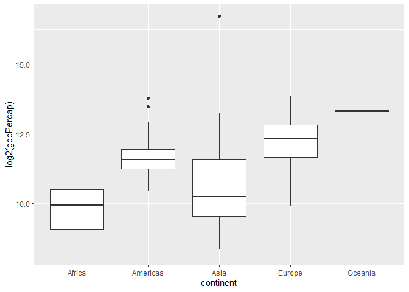
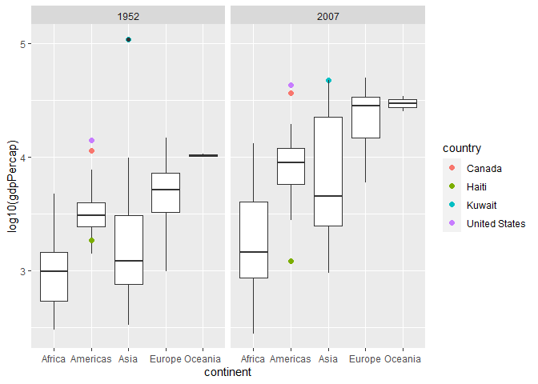
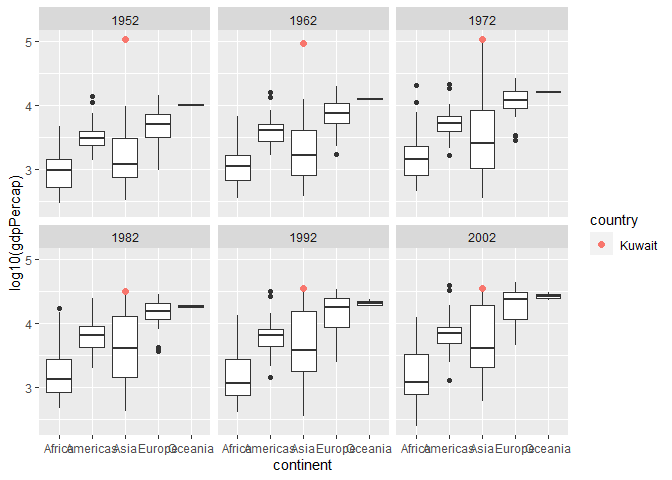
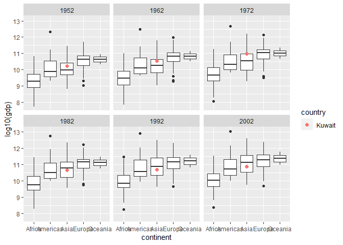
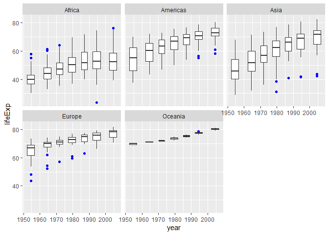

Gapminder
================
Miles Mezaki
2023-02-26

- <a href="#grading-rubric" id="toc-grading-rubric">Grading Rubric</a>
  - <a href="#individual" id="toc-individual">Individual</a>
  - <a href="#due-date" id="toc-due-date">Due Date</a>
- <a href="#guided-eda" id="toc-guided-eda">Guided EDA</a>
  - <a
    href="#q0-perform-your-first-checks-on-the-dataset-what-variables-are-in-this"
    id="toc-q0-perform-your-first-checks-on-the-dataset-what-variables-are-in-this"><strong>q0</strong>
    Perform your “first checks” on the dataset. What variables are in
    this</a>
  - <a
    href="#q1-determine-the-most-and-least-recent-years-in-the-gapminder-dataset"
    id="toc-q1-determine-the-most-and-least-recent-years-in-the-gapminder-dataset"><strong>q1</strong>
    Determine the most and least recent years in the <code>gapminder</code>
    dataset.</a>
  - <a
    href="#q2-filter-on-years-matching-year_min-and-make-a-plot-of-the-gdp-per-capita-against-continent-choose-an-appropriate-geom_-to-visualize-the-data-what-observations-can-you-make"
    id="toc-q2-filter-on-years-matching-year_min-and-make-a-plot-of-the-gdp-per-capita-against-continent-choose-an-appropriate-geom_-to-visualize-the-data-what-observations-can-you-make"><strong>q2</strong>
    Filter on years matching <code>year_min</code>, and make a plot of the
    GDP per capita against continent. Choose an appropriate
    <code>geom_</code> to visualize the data. What observations can you
    make?</a>
  - <a
    href="#q3-you-should-have-found-at-least-three-outliers-in-q2-but-possibly-many-more-identify-those-outliers-figure-out-which-countries-they-are"
    id="toc-q3-you-should-have-found-at-least-three-outliers-in-q2-but-possibly-many-more-identify-those-outliers-figure-out-which-countries-they-are"><strong>q3</strong>
    You should have found <em>at least</em> three outliers in q2 (but
    possibly many more!). Identify those outliers (figure out which
    countries they are).</a>
  - <a
    href="#q4-create-a-plot-similar-to-yours-from-q2-studying-both-year_min-and-year_max-find-a-way-to-highlight-the-outliers-from-q3-on-your-plot-in-a-way-that-lets-you-identify-which-country-is-which-compare-the-patterns-between-year_min-and-year_max"
    id="toc-q4-create-a-plot-similar-to-yours-from-q2-studying-both-year_min-and-year_max-find-a-way-to-highlight-the-outliers-from-q3-on-your-plot-in-a-way-that-lets-you-identify-which-country-is-which-compare-the-patterns-between-year_min-and-year_max"><strong>q4</strong>
    Create a plot similar to yours from q2 studying both
    <code>year_min</code> and <code>year_max</code>. Find a way to highlight
    the outliers from q3 on your plot <em>in a way that lets you identify
    which country is which</em>. Compare the patterns between
    <code>year_min</code> and <code>year_max</code>.</a>
- <a href="#your-own-eda" id="toc-your-own-eda">Your Own EDA</a>
  - <a
    href="#q5-create-at-least-three-new-figures-below-with-each-figure-try-to-pose-new-questions-about-the-data"
    id="toc-q5-create-at-least-three-new-figures-below-with-each-figure-try-to-pose-new-questions-about-the-data"><strong>q5</strong>
    Create <em>at least</em> three new figures below. With each figure, try
    to pose new questions about the data.</a>

*Purpose*: Learning to do EDA well takes practice! In this challenge
you’ll further practice EDA by first completing a guided exploration,
then by conducting your own investigation. This challenge will also give
you a chance to use the wide variety of visual tools we’ve been
learning.

<!-- include-rubric -->

# Grading Rubric

<!-- -------------------------------------------------- -->

Unlike exercises, **challenges will be graded**. The following rubrics
define how you will be graded, both on an individual and team basis.

## Individual

<!-- ------------------------- -->

| Category    | Needs Improvement                                                                                                | Satisfactory                                                                                                               |
|-------------|------------------------------------------------------------------------------------------------------------------|----------------------------------------------------------------------------------------------------------------------------|
| Effort      | Some task **q**’s left unattempted                                                                               | All task **q**’s attempted                                                                                                 |
| Observed    | Did not document observations, or observations incorrect                                                         | Documented correct observations based on analysis                                                                          |
| Supported   | Some observations not clearly supported by analysis                                                              | All observations clearly supported by analysis (table, graph, etc.)                                                        |
| Assessed    | Observations include claims not supported by the data, or reflect a level of certainty not warranted by the data | Observations are appropriately qualified by the quality & relevance of the data and (in)conclusiveness of the support      |
| Specified   | Uses the phrase “more data are necessary” without clarification                                                  | Any statement that “more data are necessary” specifies which *specific* data are needed to answer what *specific* question |
| Code Styled | Violations of the [style guide](https://style.tidyverse.org/) hinder readability                                 | Code sufficiently close to the [style guide](https://style.tidyverse.org/)                                                 |

## Due Date

<!-- ------------------------- -->

All the deliverables stated in the rubrics above are due **at midnight**
before the day of the class discussion of the challenge. See the
[Syllabus](https://docs.google.com/document/d/1qeP6DUS8Djq_A0HMllMqsSqX3a9dbcx1/edit?usp=sharing&ouid=110386251748498665069&rtpof=true&sd=true)
for more information.

``` r
library(tidyverse)
```

    ## ── Attaching packages ─────────────────────────────────────── tidyverse 1.3.2 ──
    ## ✔ ggplot2 3.4.0     ✔ purrr   1.0.1
    ## ✔ tibble  3.1.8     ✔ dplyr   1.1.0
    ## ✔ tidyr   1.3.0     ✔ stringr 1.5.0
    ## ✔ readr   2.1.3     ✔ forcats 1.0.0
    ## ── Conflicts ────────────────────────────────────────── tidyverse_conflicts() ──
    ## ✖ dplyr::filter() masks stats::filter()
    ## ✖ dplyr::lag()    masks stats::lag()

``` r
library(gapminder)
```

*Background*: [Gapminder](https://www.gapminder.org/about-gapminder/) is
an independent organization that seeks to educate people about the state
of the world. They seek to counteract the worldview constructed by a
hype-driven media cycle, and promote a “fact-based worldview” by
focusing on data. The dataset we’ll study in this challenge is from
Gapminder.

# Guided EDA

<!-- -------------------------------------------------- -->

First, we’ll go through a round of *guided EDA*. Try to pay attention to
the high-level process we’re going through—after this guided round
you’ll be responsible for doing another cycle of EDA on your own!

### **q0** Perform your “first checks” on the dataset. What variables are in this

dataset?

``` r
## TASK: Do your "first checks" here!
?gapminder
```

    ## starting httpd help server ... done

``` r
summary(gapminder)
```

    ##         country        continent        year         lifeExp     
    ##  Afghanistan:  12   Africa  :624   Min.   :1952   Min.   :23.60  
    ##  Albania    :  12   Americas:300   1st Qu.:1966   1st Qu.:48.20  
    ##  Algeria    :  12   Asia    :396   Median :1980   Median :60.71  
    ##  Angola     :  12   Europe  :360   Mean   :1980   Mean   :59.47  
    ##  Argentina  :  12   Oceania : 24   3rd Qu.:1993   3rd Qu.:70.85  
    ##  Australia  :  12                  Max.   :2007   Max.   :82.60  
    ##  (Other)    :1632                                                
    ##       pop              gdpPercap       
    ##  Min.   :6.001e+04   Min.   :   241.2  
    ##  1st Qu.:2.794e+06   1st Qu.:  1202.1  
    ##  Median :7.024e+06   Median :  3531.8  
    ##  Mean   :2.960e+07   Mean   :  7215.3  
    ##  3rd Qu.:1.959e+07   3rd Qu.:  9325.5  
    ##  Max.   :1.319e+09   Max.   :113523.1  
    ## 

**Observations**:

- country
- continent
- year
- lifeExp (expectancy)
- pop (population)
- gdpPercap (gdp per capita)

### **q1** Determine the most and least recent years in the `gapminder` dataset.

*Hint*: Use the `pull()` function to get a vector out of a tibble.
(Rather than the `$` notation of base R.)

``` r
## TASK: Find the largest and smallest values of `year` in `gapminder`
?pull

    
year_max <- gapminder %>%
  pull(var = year) %>%
    max()
year_min <- gapminder %>%
  pull(var = year) %>%
    min()
```

Use the following test to check your work.

``` r
## NOTE: No need to change this
assertthat::assert_that(year_max %% 7 == 5)
```

    ## [1] TRUE

``` r
assertthat::assert_that(year_max %% 3 == 0)
```

    ## [1] TRUE

``` r
assertthat::assert_that(year_min %% 7 == 6)
```

    ## [1] TRUE

``` r
assertthat::assert_that(year_min %% 3 == 2)
```

    ## [1] TRUE

``` r
if (is_tibble(year_max)) {
  print("year_max is a tibble; try using `pull()` to get a vector")
  assertthat::assert_that(False)
}

print("Nice!")
```

    ## [1] "Nice!"

### **q2** Filter on years matching `year_min`, and make a plot of the GDP per capita against continent. Choose an appropriate `geom_` to visualize the data. What observations can you make?

You may encounter difficulties in visualizing these data; if so document
your challenges and attempt to produce the most informative visual you
can.

``` r
## TASK: Create a visual of gdpPercap vs continent
gapminder %>%
  filter(year == year_min) %>%
    ggplot(aes(continent, log2(gdpPercap))) + geom_boxplot()
```

<!-- -->

**Observations**:

- Africa and Asia had fairly large variety in GDP per capita in 1952
  with their ranges
- The Americas and especially Oceania had very small interquartile
  ranges, Oceania in particular having very little variance whatsoever.
- On average (by median), the Americas, Europe, and Oceania tended to
  have the highest GDP per capita.

**Difficulties & Approaches**:

- I tried to do a boxplot because the data will have a series of points
  for the same country. This approach failed and the plot was
  obfuscating the x axis with what seemed like a series of numbers when
  it should have been the labels of each country. The y axis did not
  even display boxplots, but individual points.
- I realized this was because I was plotting by country and not by
  continent, which was what I intended to do.
- The boxplot was extremely squished due to an extreme outlier
  compressing the rest of the graph
- Because of the height difference, I decided to plot gdpPercap on a log
  scale.

### **q3** You should have found *at least* three outliers in q2 (but possibly many more!). Identify those outliers (figure out which countries they are).

``` r
## TASK: Identify the outliers from q2
findoutlier <- function(x) {
  x <- log10(x)
  return(x < quantile(x, .25) - 1.5*IQR(x) | x > quantile(x, .75) + 1.5*IQR(x))
}

find_outliers_by_year <- function(yr) {
  return(gapminder %>%
           filter(year == yr) %>%
            group_by(continent) %>%
              filter(findoutlier(gdpPercap))
         )
}

outliers_min <- find_outliers_by_year(year_min)
outliers_min
```

    ## # A tibble: 3 × 6
    ## # Groups:   continent [2]
    ##   country       continent  year lifeExp       pop gdpPercap
    ##   <fct>         <fct>     <int>   <dbl>     <int>     <dbl>
    ## 1 Canada        Americas   1952    68.8  14785584    11367.
    ## 2 Kuwait        Asia       1952    55.6    160000   108382.
    ## 3 United States Americas   1952    68.4 157553000    13990.

``` r
outliers_max <- find_outliers_by_year(year_max)
outliers_max
```

    ## # A tibble: 3 × 6
    ## # Groups:   continent [1]
    ##   country       continent  year lifeExp       pop gdpPercap
    ##   <fct>         <fct>     <int>   <dbl>     <int>     <dbl>
    ## 1 Canada        Americas   2007    80.7  33390141    36319.
    ## 2 Haiti         Americas   2007    60.9   8502814     1202.
    ## 3 United States Americas   2007    78.2 301139947    42952.

**Observations**:

- Identify the outlier countries from q2
  - The outliers I found were Canada, the US, and most notably Kuwait

*Hint*: For the next task, it’s helpful to know a ggplot trick we’ll
learn in an upcoming exercise: You can use the `data` argument inside
any `geom_*` to modify the data that will be plotted *by that geom
only*. For instance, you can use this trick to filter a set of points to
label:

``` r
## NOTE: No need to edit, use ideas from this in q4 below
gapminder %>%
  filter(year == max(year)) %>%

  ggplot(aes(continent, lifeExp)) +
  geom_boxplot() +
  geom_point(
    data = . %>% filter(country %in% c("United Kingdom", "Japan", "Zambia")),
    mapping = aes(color = country),
    size = 2
  )
```

<!-- -->

### **q4** Create a plot similar to yours from q2 studying both `year_min` and `year_max`. Find a way to highlight the outliers from q3 on your plot *in a way that lets you identify which country is which*. Compare the patterns between `year_min` and `year_max`.

*Hint*: We’ve learned a lot of different ways to show multiple
variables; think about using different aesthetics or facets.

``` r
## TASK: Create a visual of gdpPercap vs continent


gapminder %>%
  filter(year == year_min | year == year_max) %>%
ggplot(aes(continent, log10(gdpPercap))) +
geom_boxplot() +
geom_point(
    data = . %>% filter(country %in% outliers_min$country),
    mapping = aes(color = country),
    size = 2
  ) + 

geom_boxplot() +
geom_point(
    data = . %>% filter(country %in% outliers_max$country),
    mapping = aes(color = country),
    size = 2) +
  facet_wrap(~ year)
```

<!-- -->

**Observations**:

- The United States and Canada, in both 1952 and 2007, had a
  significantly stronger GDP than the rest of their continent (or in
  this case, both continents their region encompasses)
- Kuwait had a spectacularly high GDP in comparison to Asian and with
  respect to any other country in the world in 1952, and was still at
  the higher end of GDP per capita in 2007, but was then within 1.5
  times the interquartile range.
- Haiti was on the lower end of GDP per capita in 1952, but was severely
  below the interquartile range for GDP per capita in 2007.

# Your Own EDA

<!-- -------------------------------------------------- -->

Now it’s your turn! We just went through guided EDA considering the GDP
per capita at two time points. You can continue looking at outliers,
consider different years, repeat the exercise with `lifeExp`, consider
the relationship between variables, or something else entirely.

### **q5** Create *at least* three new figures below. With each figure, try to pose new questions about the data.

``` r
## TASK: Your first graph


## First I would like to see the trends of countries over the decades.
## In particular I am curious about the GDP per capita of Kuwait.
outliers_1952 <- find_outliers_by_year(year_min)
outliers_1952
```

    ## # A tibble: 3 × 6
    ## # Groups:   continent [2]
    ##   country       continent  year lifeExp       pop gdpPercap
    ##   <fct>         <fct>     <int>   <dbl>     <int>     <dbl>
    ## 1 Canada        Americas   1952    68.8  14785584    11367.
    ## 2 Kuwait        Asia       1952    55.6    160000   108382.
    ## 3 United States Americas   1952    68.4 157553000    13990.

``` r
outliers_1962 <- find_outliers_by_year(1962)
outliers_1962
```

    ## # A tibble: 4 × 6
    ## # Groups:   continent [3]
    ##   country                continent  year lifeExp       pop gdpPercap
    ##   <fct>                  <fct>     <int>   <dbl>     <int>     <dbl>
    ## 1 Bosnia and Herzegovina Europe     1962    61.9   3349000     1710.
    ## 2 Canada                 Americas   1962    71.3  18985849    13462.
    ## 3 Kuwait                 Asia       1962    60.5    358266    95458.
    ## 4 United States          Americas   1962    70.2 186538000    16173.

``` r
outliers_1972 <- find_outliers_by_year(1972)
outliers_1972
```

    ## # A tibble: 8 × 6
    ## # Groups:   continent [3]
    ##   country                continent  year lifeExp       pop gdpPercap
    ##   <fct>                  <fct>     <int>   <dbl>     <int>     <dbl>
    ## 1 Albania                Europe     1972    67.7   2263554     3313.
    ## 2 Bosnia and Herzegovina Europe     1972    67.4   3819000     2860.
    ## 3 Canada                 Americas   1972    72.9  22284500    18971.
    ## 4 Gabon                  Africa     1972    48.7    537977    11402.
    ## 5 Haiti                  Americas   1972    48.0   4698301     1654.
    ## 6 Libya                  Africa     1972    52.8   2183877    21011.
    ## 7 Turkey                 Europe     1972    57.0  37492953     3451.
    ## 8 United States          Americas   1972    71.3 209896000    21806.

``` r
outliers_1982 <- find_outliers_by_year(1982)

outliers_1992 <- find_outliers_by_year(1992)

outliers_2002 <- find_outliers_by_year(2002)

gapminder %>%
  filter(year %in% c(year_min, 1962, 1972, 1982, 1992, 2002)) %>%
ggplot(aes(continent, log10(gdpPercap))) +
geom_boxplot() +
geom_point(
    data = . %>% filter(country == "Kuwait"),
    mapping = aes(color = country),
    size = 2
  ) + 

geom_boxplot() +
geom_point(
    data = . %>% filter(country == "Kuwait"),
    mapping = aes(color = country),
    size = 2) +
  facet_wrap(~ year) + 

geom_boxplot() +
geom_point(
    data = . %>% filter(country == "Kuwait"),
    mapping = aes(color = country),
    size = 2) +
  facet_wrap(~ year) + 

geom_boxplot() +
geom_point(
    data = . %>% filter(country == "Kuwait"),
    mapping = aes(color = country),
    size = 2) +
  facet_wrap(~ year) + 

geom_boxplot() +
geom_point(
    data = . %>% filter(country == "Kuwait"),
    mapping = aes(color = country),
    size = 2) +
  facet_wrap(~ year) + 

geom_boxplot() +
geom_point(
    data = . %>% filter(country == "Kuwait"),
    mapping = aes(color = country),
    size = 2) +
  facet_wrap(~ year)
```

<!-- -->

- Across every 10 years starting from the earliest year in the Gapminder
  dataset, Kuwait has had one of the highest, if not the highest GDPs
  per capita
  - What geopolitical reasons are there for this?

  - Is Kuwait’s GDP per capita statistic being inflated by a
    comparatively small population size?

  - How does Kuwait’s GDP stack up against other world GDPs?

``` r
## TASK: Your second graph

## I would like to know about Kuwait's population relative to other countries' in these timeframes to measure GDP
## I will measure GDP by multiplying GDP per capita by population size

gapminder %>%
  filter(year %in% c(year_min, 1962, 1972, 1982, 1992, 2002)) %>%
  mutate(gdp = gdpPercap * pop) %>%
    ggplot(aes(continent, log10(gdp))) +
    geom_boxplot() +
    geom_point(
        data = . %>% filter(country == "Kuwait"),
        mapping = aes(color = country),
        size = 2
      ) + 
    
    geom_boxplot() +
    geom_point(
        data = . %>% filter(country == "Kuwait"),
        mapping = aes(color = country),
        size = 2) +
      facet_wrap(~ year) + 
    
    geom_boxplot() +
    geom_point(
        data = . %>% filter(country == "Kuwait"),
        mapping = aes(color = country),
        size = 2) +
      facet_wrap(~ year) + 
    
    geom_boxplot() +
    geom_point(
        data = . %>% filter(country == "Kuwait"),
        mapping = aes(color = country),
        size = 2) +
      facet_wrap(~ year) + 
    
    geom_boxplot() +
    geom_point(
        data = . %>% filter(country == "Kuwait"),
        mapping = aes(color = country),
        size = 2) +
      facet_wrap(~ year) + 
    
    geom_boxplot() +
    geom_point(
        data = . %>% filter(country == "Kuwait"),
        mapping = aes(color = country),
        size = 2) +
      facet_wrap(~ year)
```

<!-- -->

- While Kuwait’s GDP per capita statistic is quite an outlier, its
  actual GDP lies well within the IQR for the years visualized, with the
  exception of 1972. There are new outliers that emerge when testing
  GDP, however.
- What are these other outliers?
- What economic influences and historical contexts caused these
  abnormally high or low GDPs?
- Did these countries have normal GDPs per capita despite having outlier
  GDPs?
- Were there any countries that both had outlier GDP and outlier GDP per
  capita?

``` r
## TASK: Your third graph

## I would like to know if life expectancy has any correlation with the passage of time
## I will test this relationship with each continent receiving its own category

gapminder %>%
    group_by(continent) %>%
      ggplot() +
      geom_boxplot(mapping = aes(x = year, y = lifeExp, group = cut_interval(year, n = 7)), outlier.color = "blue") +
      facet_wrap(~ continent)
```

<!-- -->

- While there are some outliers, the trend over time of the median life
  expectancy for each continent is an upward one. This may have to do
  with technology, globalization, or other factors, but that is thus far
  unsupported by data in gapminder.
- There are some continents whose medians have changed less quickly than
  others’.
- Does average GDP per capita over the span of the continent influence
  life expectancy for that continent?
- Does the rate of GDP per capita increase correlate with the rate of
  change of life expectancy?
- Why is the IQR for Oceania so minute for both life expectancy and GDP
  per capita as a function of time? Is this to do with a lack of data?
- What countries have outlier life expectancies and why? Is there
  context as to why, such as natural disasters?
