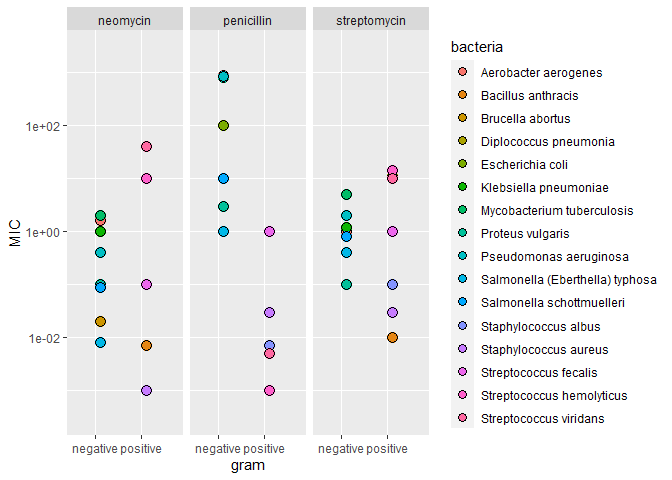
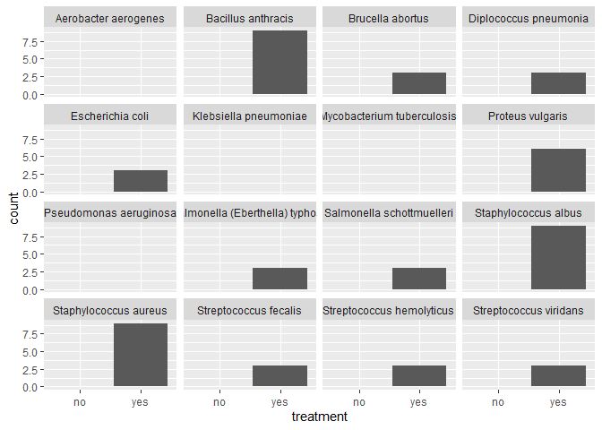
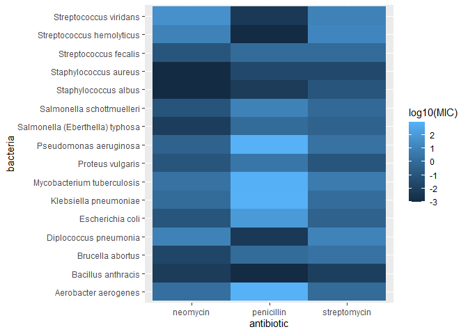
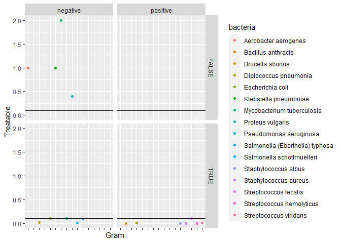

Antibiotics
================
Miles Mezaki
2023-04-23

*Purpose*: Creating effective data visualizations is an *iterative*
process; very rarely will the first graph you make be the most
effective. The most effective thing you can do to be successful in this
iterative process is to *try multiple graphs* of the same data.

Furthermore, judging the effectiveness of a visual is completely
dependent on *the question you are trying to answer*. A visual that is
totally ineffective for one question may be perfect for answering a
different question.

In this challenge, you will practice *iterating* on data visualization,
and will anchor the *assessment* of your visuals using two different
questions.

*Note*: Please complete your initial visual design **alone**. Work on
both of your graphs alone, and save a version to your repo *before*
coming together with your team. This way you can all bring a diversity
of ideas to the table!

<!-- include-rubric -->

# Grading Rubric

<!-- -------------------------------------------------- -->

Unlike exercises, **challenges will be graded**. The following rubrics
define how you will be graded, both on an individual and team basis.

## Individual

<!-- ------------------------- -->

| Category    | Needs Improvement                                                                                                | Satisfactory                                                                                                               |
|-------------|------------------------------------------------------------------------------------------------------------------|----------------------------------------------------------------------------------------------------------------------------|
| Effort      | Some task **q**’s left unattempted                                                                               | All task **q**’s attempted                                                                                                 |
| Observed    | Did not document observations, or observations incorrect                                                         | Documented correct observations based on analysis                                                                          |
| Supported   | Some observations not clearly supported by analysis                                                              | All observations clearly supported by analysis (table, graph, etc.)                                                        |
| Assessed    | Observations include claims not supported by the data, or reflect a level of certainty not warranted by the data | Observations are appropriately qualified by the quality & relevance of the data and (in)conclusiveness of the support      |
| Specified   | Uses the phrase “more data are necessary” without clarification                                                  | Any statement that “more data are necessary” specifies which *specific* data are needed to answer what *specific* question |
| Code Styled | Violations of the [style guide](https://style.tidyverse.org/) hinder readability                                 | Code sufficiently close to the [style guide](https://style.tidyverse.org/)                                                 |

## Due Date

<!-- ------------------------- -->

All the deliverables stated in the rubrics above are due **at midnight**
before the day of the class discussion of the challenge. See the
[Syllabus](https://docs.google.com/document/d/1qeP6DUS8Djq_A0HMllMqsSqX3a9dbcx1/edit?usp=sharing&ouid=110386251748498665069&rtpof=true&sd=true)
for more information.

``` r
library(tidyverse)
```

    ## ── Attaching packages ─────────────────────────────────────── tidyverse 1.3.2 ──
    ## ✔ ggplot2 3.4.0     ✔ purrr   1.0.1
    ## ✔ tibble  3.1.8     ✔ dplyr   1.1.0
    ## ✔ tidyr   1.3.0     ✔ stringr 1.5.0
    ## ✔ readr   2.1.3     ✔ forcats 1.0.0
    ## ── Conflicts ────────────────────────────────────────── tidyverse_conflicts() ──
    ## ✖ dplyr::filter() masks stats::filter()
    ## ✖ dplyr::lag()    masks stats::lag()

``` r
library(ggrepel)
```

*Background*: The data\[1\] we study in this challenge report the
[*minimum inhibitory
concentration*](https://en.wikipedia.org/wiki/Minimum_inhibitory_concentration)
(MIC) of three drugs for different bacteria. The smaller the MIC for a
given drug and bacteria pair, the more practical the drug is for
treating that particular bacteria. An MIC value of *at most* 0.1 is
considered necessary for treating human patients.

These data report MIC values for three antibiotics—penicillin,
streptomycin, and neomycin—on 16 bacteria. Bacteria are categorized into
a genus based on a number of features, including their resistance to
antibiotics.

``` r
## NOTE: If you extracted all challenges to the same location,
## you shouldn't have to change this filename
filename <- "./data/antibiotics.csv"

## Load the data
df_antibiotics <- read_csv(filename)
```

    ## Rows: 16 Columns: 5
    ## ── Column specification ────────────────────────────────────────────────────────
    ## Delimiter: ","
    ## chr (2): bacteria, gram
    ## dbl (3): penicillin, streptomycin, neomycin
    ## 
    ## ℹ Use `spec()` to retrieve the full column specification for this data.
    ## ℹ Specify the column types or set `show_col_types = FALSE` to quiet this message.

``` r
df_antibiotics %>% knitr::kable()
```

| bacteria                        | penicillin | streptomycin | neomycin | gram     |
|:--------------------------------|-----------:|-------------:|---------:|:---------|
| Aerobacter aerogenes            |    870.000 |         1.00 |    1.600 | negative |
| Brucella abortus                |      1.000 |         2.00 |    0.020 | negative |
| Bacillus anthracis              |      0.001 |         0.01 |    0.007 | positive |
| Diplococcus pneumonia           |      0.005 |        11.00 |   10.000 | positive |
| Escherichia coli                |    100.000 |         0.40 |    0.100 | negative |
| Klebsiella pneumoniae           |    850.000 |         1.20 |    1.000 | negative |
| Mycobacterium tuberculosis      |    800.000 |         5.00 |    2.000 | negative |
| Proteus vulgaris                |      3.000 |         0.10 |    0.100 | negative |
| Pseudomonas aeruginosa          |    850.000 |         2.00 |    0.400 | negative |
| Salmonella (Eberthella) typhosa |      1.000 |         0.40 |    0.008 | negative |
| Salmonella schottmuelleri       |     10.000 |         0.80 |    0.090 | negative |
| Staphylococcus albus            |      0.007 |         0.10 |    0.001 | positive |
| Staphylococcus aureus           |      0.030 |         0.03 |    0.001 | positive |
| Streptococcus fecalis           |      1.000 |         1.00 |    0.100 | positive |
| Streptococcus hemolyticus       |      0.001 |        14.00 |   10.000 | positive |
| Streptococcus viridans          |      0.005 |        10.00 |   40.000 | positive |

# Visualization

<!-- -------------------------------------------------- -->

### **q1** Prototype 5 visuals

To start, construct **5 qualitatively different visualizations of the
data** `df_antibiotics`. These **cannot** be simple variations on the
same graph; for instance, if two of your visuals could be made identical
by calling `coord_flip()`, then these are *not* qualitatively different.

For all five of the visuals, you must show information on *all 16
bacteria*. For the first two visuals, you must *show all variables*.

*Hint 1*: Try working quickly on this part; come up with a bunch of
ideas, and don’t fixate on any one idea for too long. You will have a
chance to refine later in this challenge.

*Hint 2*: The data `df_antibiotics` are in a *wide* format; it may be
helpful to `pivot_longer()` the data to make certain visuals easier to
construct.

#### Visual 1 (All variables)

In this visual you must show *all three* effectiveness values for *all
16 bacteria*. You must also show whether or not each bacterium is Gram
positive or negative.

``` r
# WRITE YOUR CODE HERE
df_longer <- df_antibiotics %>%
  pivot_longer(
    names_to = "antibiotic",
    values_to = "MIC",
    cols = c(penicillin, streptomycin, neomycin)
  ) 
df_longer %>%
    ggplot() +
    geom_dotplot(mapping = aes(x = gram, y = MIC, fill = bacteria), binaxis = "y", 
               dotsize = 0.2, binwidth = 1) +
    scale_y_log10() +
    facet_wrap(~ antibiotic)
```

<!-- -->

#### Visual 2 (All variables)

In this visual you must show *all three* effectiveness values for *all
16 bacteria*. You must also show whether or not each bacterium is Gram
positive or negative.

Note that your visual must be *qualitatively different* from *all* of
your other visuals.

``` r
# WRITE YOUR CODE HERE
df_longer %>%
  ggplot(aes(shape = gram)) +
  geom_point(mapping = aes(x = bacteria, y = MIC, color = antibiotic)) +
  geom_hline(yintercept = 0.1, color = "black") +
  scale_y_log10() +
  labs(y="MIC") +
  theme(axis.text.x = element_text(angle = 90, vjust = 0.5, hjust=1))
```

<!-- -->

#### Visual 3 (Some variables)

In this visual you may show a *subset* of the variables (`penicillin`,
`streptomycin`, `neomycin`, `gram`), but you must still show *all 16
bacteria*.

Note that your visual must be *qualitatively different* from *all* of
your other visuals.

``` r
# WRITE YOUR CODE HERE

df_antibiotics %>%
  mutate(treatment = ifelse((penicillin <= 0.1) | (streptomycin <= 0.1) | (neomycin <= 0.1), "yes", "no")) %>%
  mutate(count = (penicillin <= 0.1) + (streptomycin <= 0.1) + (neomycin <= 0.1)) %>%
  pivot_longer(
    names_to = "antibiotic",
    values_to = "MIC",
    cols = c(penicillin, streptomycin, neomycin)
  ) %>%
  ggplot() +
  geom_col(mapping = aes(x = treatment, y = count)) +
  facet_wrap(~ bacteria)
```

<!-- -->

#### Visual 4 (Some variables)

In this visual you may show a *subset* of the variables (`penicillin`,
`streptomycin`, `neomycin`, `gram`), but you must still show *all 16
bacteria*.

Note that your visual must be *qualitatively different* from *all* of
your other visuals.

``` r
# WRITE YOUR CODE HERE
df_longer %>%
  ggplot() +
  geom_tile(mapping = aes(x = antibiotic, y = bacteria, fill = log10(MIC)))
```

<!-- -->

#### Visual 5 (Some variables)

In this visual you may show a *subset* of the variables (`penicillin`,
`streptomycin`, `neomycin`, `gram`), but you must still show *all 16
bacteria*.

Note that your visual must be *qualitatively different* from *all* of
your other visuals.

``` r
# WRITE YOUR CODE HERE
df_antibiotics %>%
    mutate(treatable = (penicillin <= 0.1) | (streptomycin <= 0.1) | (neomycin <= 0.1)) %>%
    ggplot() +
    geom_point(mapping = aes(x = bacteria, y = pmin(penicillin, streptomycin, neomycin), color = bacteria)) +
    geom_hline(yintercept = 0.1, color = 'black') +
    theme(axis.text.x = element_blank()) +
    xlab("Gram") + 
    ylab("Treatable") +
    facet_grid( treatable ~ gram)
```

<!-- -->

### **q2** Assess your visuals

There are **two questions** below; use your five visuals to help answer
both Guiding Questions. Note that you must also identify which of your
five visuals were most helpful in answering the questions.

*Hint 1*: It’s possible that *none* of your visuals is effective in
answering the questions below. You may need to revise one or more of
your visuals to answer the questions below!

*Hint 2*: It’s **highly unlikely** that the same visual is the most
effective at helping answer both guiding questions. **Use this as an
opportunity to think about why this is.**

#### Guiding Question 1

> How do the three antibiotics vary in their effectiveness against
> bacteria of different genera and Gram stain?

*Observations* -

What is your response to the question above?

- Penicillin seems to be very effective in treating bacteria in the
  genus of staphylococcus or streptococcus (all gram positive) as the
  MIC of penicillin is sufficiently low to be effective in human
  treatment. It’s rather impractical for other strains, though it does
  inhibit their growth eventually.

- Neomycin is effective against strains of salmonella as well as the
  brucella strain. These are gram negative bacteria. It also does
  reasonably well against three gram positive bacteria: one bacillus,
  one streptococcus, and one staphylococcus. In general, the MIC tends
  to be smaller and seems to have less spread for gram negative
  bacteria.

- Streptomycin seems to be effective and practical for only four genera,
  proteus (gram negative), bacillus (gram positive), and the two
  staphylococci in the dataset (both gram positive). This seems to
  indicate that practicality favors streptomycin use against gram
  positive bacteria, although the eye test indicates that on average the
  gram negative bacteria might have lower MIC.

Which of your visuals above (1 through 5) is **most effective** at
helping to answer this question?

- The dot plot (1) was easily most effective at answering this question.

Why?

- It was easy to have a visualization where data is separated between
  gram positive and negative, whereas it was only indicated by shape
  with others, which would’ve been harder to read.

- Having all bacteria colored was nice, especially given that there are
  few enough bacteria in the dataset where colors are distinguishable.
  It was also fortunate that their order is one such that similar colors
  are from similar strains (e.g. staphylococci).

#### Guiding Question 2

In 1974 *Diplococcus pneumoniae* was renamed *Streptococcus pneumoniae*,
and in 1984 *Streptococcus fecalis* was renamed *Enterococcus fecalis*
\[2\].

> Why was *Diplococcus pneumoniae* was renamed *Streptococcus
> pneumoniae*?

*Observations* - What is your response to the question above?

- Against various antibiotics, they receive very similar MIC ratings.
  [Similar MIC ratings can suggest similar biological
  characteristics](https://www.ncbi.nlm.nih.gov/pmc/articles/PMC6428495/),
  and so could be an indicator of an underlying driver of this change.

- They are all gram positive; [members who belong to this family cause
  different infections than those in the gram negative
  family.](https://medlineplus.gov/lab-tests/gram-stain/)

Which of your visuals above (1 through 5) is **most effective** at
helping to answer this question?

- My scatterplot (2) was most effective at answering this question.

Why?

- It contains information about both their MIC and gram grades.
  Visualizations 3 and 5 target the number of/kind of antibiotics that
  are worthy for human treatment, and were designed to answer questions
  more in the line of “how practical is”x” antibiotic against “y”
  bacteria. Visualization 1 makes it difficult to see diplococcus
  pneumoniae since it is so close to streptococci, but it it were
  distinguishable then perhaps visualization 1 would be in contention.
  Visualization 4 is certainly a winner, because the heatmap’s pattern
  for diplococcus pneumoniae echoes what can be seen for two of the
  three streptococci very similarly. On the other hand, it didn’t answer
  the question of whether they were gram positive or gram negative, so I
  decided that visualization 2 helped me answer the question best.

# References

<!-- -------------------------------------------------- -->

\[1\] Neomycin in skin infections: A new topical antibiotic with wide
antibacterial range and rarely sensitizing. Scope. 1951;3(5):4-7.

\[2\] Wainer and Lysen, “That’s Funny…” *American Scientist* (2009)
[link](https://www.americanscientist.org/article/thats-funny)
