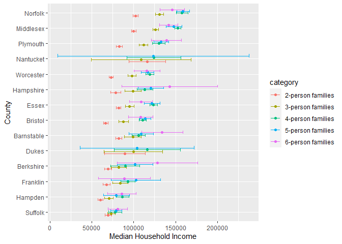
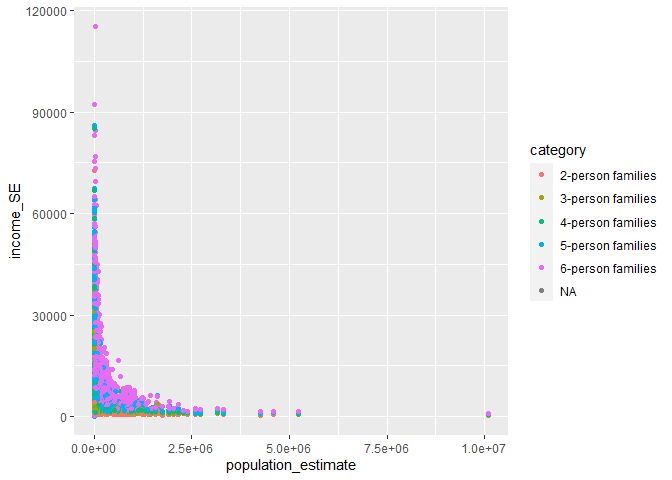
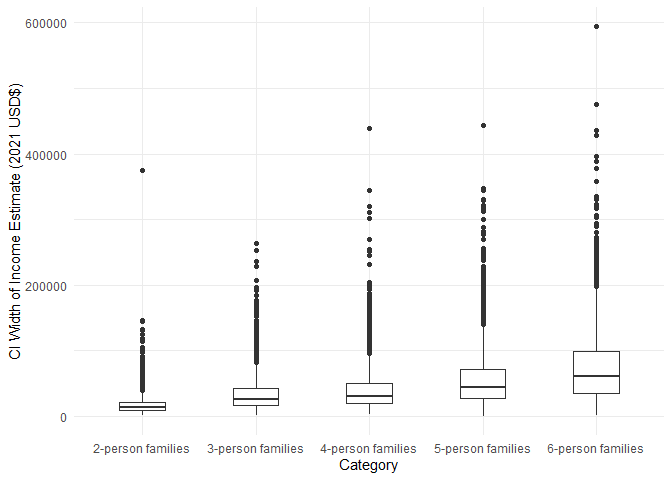

US Income
================
Miles Mezaki
2023-04-09

- <a href="#grading-rubric" id="toc-grading-rubric">Grading Rubric</a>
  - <a href="#individual" id="toc-individual">Individual</a>
  - <a href="#due-date" id="toc-due-date">Due Date</a>
- <a href="#setup" id="toc-setup">Setup</a>
  - <a
    href="#q1-load-the-population-data-from-c06-simply-replace-filename_pop-below"
    id="toc-q1-load-the-population-data-from-c06-simply-replace-filename_pop-below"><strong>q1</strong>
    Load the population data from c06; simply replace
    <code>filename_pop</code> below.</a>
  - <a href="#q2-obtain-median-income-data-from-the-census-bureau"
    id="toc-q2-obtain-median-income-data-from-the-census-bureau"><strong>q2</strong>
    Obtain median income data from the Census Bureau:</a>
  - <a
    href="#q3-tidy-the-df_income-dataset-by-completing-the-code-below-pivot-and-rename-the-columns-to-arrive-at-the-column-names-id-geographic_area_name-category-income_estimate-income_moe"
    id="toc-q3-tidy-the-df_income-dataset-by-completing-the-code-below-pivot-and-rename-the-columns-to-arrive-at-the-column-names-id-geographic_area_name-category-income_estimate-income_moe"><strong>q3</strong>
    Tidy the <code>df_income</code> dataset by completing the code below.
    Pivot and rename the columns to arrive at the column names
    <code>id, geographic_area_name, category, income_estimate, income_moe</code>.</a>
  - <a
    href="#q4-convert-the-margin-of-error-to-standard-error-additionally-compute-a-99-confidence-interval-on-income-and-normalize-the-standard-error-to-income_cv--income_se--income_estimate-provide-these-columns-with-the-names-income_se-income_lo-income_hi-income_cv"
    id="toc-q4-convert-the-margin-of-error-to-standard-error-additionally-compute-a-99-confidence-interval-on-income-and-normalize-the-standard-error-to-income_cv--income_se--income_estimate-provide-these-columns-with-the-names-income_se-income_lo-income_hi-income_cv"><strong>q4</strong>
    Convert the margin of error to standard error. Additionally, compute a
    99% confidence interval on income, and normalize the standard error to
    <code>income_CV = income_SE / income_estimate</code>. Provide these
    columns with the names
    <code>income_SE, income_lo, income_hi, income_CV</code>.</a>
  - <a href="#q5-join-df_q4-and-df_pop"
    id="toc-q5-join-df_q4-and-df_pop"><strong>q5</strong> Join
    <code>df_q4</code> and <code>df_pop</code>.</a>
- <a href="#analysis" id="toc-analysis">Analysis</a>
  - <a
    href="#q6-study-the-following-graph-making-sure-to-note-what-you-can-and-cant-conclude-based-on-the-estimates-and-confidence-intervals-document-your-observations-below-and-answer-the-questions"
    id="toc-q6-study-the-following-graph-making-sure-to-note-what-you-can-and-cant-conclude-based-on-the-estimates-and-confidence-intervals-document-your-observations-below-and-answer-the-questions"><strong>q6</strong>
    Study the following graph, making sure to note what you can <em>and
    can’t</em> conclude based on the estimates and confidence intervals.
    Document your observations below and answer the questions.</a>
  - <a
    href="#q7-plot-the-standard-error-against-population-for-all-counties-create-a-visual-that-effectively-highlights-the-trends-in-the-data-answer-the-questions-under-observations-below"
    id="toc-q7-plot-the-standard-error-against-population-for-all-counties-create-a-visual-that-effectively-highlights-the-trends-in-the-data-answer-the-questions-under-observations-below"><strong>q7</strong>
    Plot the standard error against population for all counties. Create a
    visual that effectively highlights the trends in the data. Answer the
    questions under <em>observations</em> below.</a>
- <a href="#going-further" id="toc-going-further">Going Further</a>
  - <a
    href="#q8-pose-your-own-question-about-the-data-create-a-visualization-or-table-here-and-document-your-observations"
    id="toc-q8-pose-your-own-question-about-the-data-create-a-visualization-or-table-here-and-document-your-observations"><strong>q8</strong>
    Pose your own question about the data. Create a visualization (or table)
    here, and document your observations.</a>
- <a href="#references" id="toc-references">References</a>

*Purpose*: We’ve been learning how to quantify uncertainty in estimates
through the exercises; now its time to put those skills to use studying
real data. In this challenge we’ll use concepts like confidence
intervals to help us make sense of census data.

*Reading*: - [Using ACS Estimates and Margin of
Error](https://www.census.gov/programs-surveys/acs/guidance/training-presentations/acs-moe.html)
(Optional) - [Patterns and Causes of Uncertainty in the American
Community
Survey](https://www.sciencedirect.com/science/article/pii/S0143622813002518?casa_token=VddzQ1-spHMAAAAA:FTq92LXgiPVloJUVjnHs8Ma1HwvPigisAYtzfqaGbbRRwoknNq56Y2IzszmGgIGH4JAPzQN0)
(Optional, particularly the *Uncertainty in surveys* section under the
Introduction.)

<!-- include-rubric -->

# Grading Rubric

<!-- -------------------------------------------------- -->

Unlike exercises, **challenges will be graded**. The following rubrics
define how you will be graded, both on an individual and team basis.

## Individual

<!-- ------------------------- -->

| Category    | Needs Improvement                                                                                                | Satisfactory                                                                                                               |
|-------------|------------------------------------------------------------------------------------------------------------------|----------------------------------------------------------------------------------------------------------------------------|
| Effort      | Some task **q**’s left unattempted                                                                               | All task **q**’s attempted                                                                                                 |
| Observed    | Did not document observations, or observations incorrect                                                         | Documented correct observations based on analysis                                                                          |
| Supported   | Some observations not clearly supported by analysis                                                              | All observations clearly supported by analysis (table, graph, etc.)                                                        |
| Assessed    | Observations include claims not supported by the data, or reflect a level of certainty not warranted by the data | Observations are appropriately qualified by the quality & relevance of the data and (in)conclusiveness of the support      |
| Specified   | Uses the phrase “more data are necessary” without clarification                                                  | Any statement that “more data are necessary” specifies which *specific* data are needed to answer what *specific* question |
| Code Styled | Violations of the [style guide](https://style.tidyverse.org/) hinder readability                                 | Code sufficiently close to the [style guide](https://style.tidyverse.org/)                                                 |

## Due Date

<!-- ------------------------- -->

All the deliverables stated in the rubrics above are due **at midnight**
before the day of the class discussion of the challenge. See the
[Syllabus](https://docs.google.com/document/d/1qeP6DUS8Djq_A0HMllMqsSqX3a9dbcx1/edit?usp=sharing&ouid=110386251748498665069&rtpof=true&sd=true)
for more information.

# Setup

<!-- ----------------------------------------------------------------------- -->

``` r
library(tidyverse)
```

    ## ── Attaching packages ─────────────────────────────────────── tidyverse 1.3.2 ──
    ## ✔ ggplot2 3.4.0     ✔ purrr   1.0.1
    ## ✔ tibble  3.1.8     ✔ dplyr   1.1.0
    ## ✔ tidyr   1.3.0     ✔ stringr 1.5.0
    ## ✔ readr   2.1.3     ✔ forcats 1.0.0
    ## ── Conflicts ────────────────────────────────────────── tidyverse_conflicts() ──
    ## ✖ dplyr::filter() masks stats::filter()
    ## ✖ dplyr::lag()    masks stats::lag()

### **q1** Load the population data from c06; simply replace `filename_pop` below.

``` r
## TODO: Give the filename for your copy of Table B01003
filename_pop <- "data/ACSDT5Y2018.B01003-Data.csv"

## NOTE: No need to edit
df_pop <-
  read_csv(
    filename_pop,
    skip = 2,
    col_names = c(
      "id",
      "geographic_area_name",
      "population_estimate",
      "population_moe"
    )
  )
```

    ## Rows: 3220 Columns: 7
    ## ── Column specification ────────────────────────────────────────────────────────
    ## Delimiter: ","
    ## chr (5): id, geographic_area_name, population_moe, X5, X6
    ## dbl (1): population_estimate
    ## lgl (1): X7
    ## 
    ## ℹ Use `spec()` to retrieve the full column specification for this data.
    ## ℹ Specify the column types or set `show_col_types = FALSE` to quiet this message.

``` r
df_pop
```

    ## # A tibble: 3,220 × 7
    ##    id             geographic_area_name     populatio…¹ popul…² X5    X6    X7   
    ##    <chr>          <chr>                          <dbl> <chr>   <chr> <chr> <lgl>
    ##  1 0500000US01001 Autauga County, Alabama        55200 null    ***** ***** NA   
    ##  2 0500000US01003 Baldwin County, Alabama       208107 null    ***** ***** NA   
    ##  3 0500000US01005 Barbour County, Alabama        25782 null    ***** ***** NA   
    ##  4 0500000US01007 Bibb County, Alabama           22527 null    ***** ***** NA   
    ##  5 0500000US01009 Blount County, Alabama         57645 null    ***** ***** NA   
    ##  6 0500000US01011 Bullock County, Alabama        10352 null    ***** ***** NA   
    ##  7 0500000US01013 Butler County, Alabama         20025 null    ***** ***** NA   
    ##  8 0500000US01015 Calhoun County, Alabama       115098 null    ***** ***** NA   
    ##  9 0500000US01017 Chambers County, Alabama       33826 null    ***** ***** NA   
    ## 10 0500000US01019 Cherokee County, Alabama       25853 null    ***** ***** NA   
    ## # … with 3,210 more rows, and abbreviated variable names ¹​population_estimate,
    ## #   ²​population_moe

You might wonder why the `Margin of Error` in the population estimates
is listed as `*****`. From the [documentation (PDF
link)](https://www.google.com/url?sa=t&rct=j&q=&esrc=s&source=web&cd=&cad=rja&uact=8&ved=2ahUKEwj81Omy16TrAhXsguAKHTzKDQEQFjABegQIBxAB&url=https%3A%2F%2Fwww2.census.gov%2Fprograms-surveys%2Facs%2Ftech_docs%2Faccuracy%2FMultiyearACSAccuracyofData2018.pdf%3F&usg=AOvVaw2TOrVuBDlkDI2gde6ugce_)
for the ACS:

> If the margin of error is displayed as ‘\*\*\*\*\*’ (five asterisks),
> the estimate has been controlled to be equal to a fixed value and so
> it has no sampling error. A standard error of zero should be used for
> these controlled estimates when completing calculations, such as those
> in the following section.

This means that for cases listed as `*****` the US Census Bureau
recommends treating the margin of error (and thus standard error) as
zero.

### **q2** Obtain median income data from the Census Bureau:

- `Filter > Topics > Income and Poverty > Income and Poverty`
- `Filter > Geography > County > All counties in United States`
- Look for `Median Income in the Past 12 Months` (Table S1903)
- Download the 2018 5-year ACS estimates; save to your `data` folder and
  add the filename below.

``` r
## TODO: Give the filename for your copy of Table S1903
filename_income <- "data/ACSST5Y2018.S1903-Data.csv"

## NOTE: No need to edit
df_income <-
  read_csv(filename_income, skip = 1)
```

    ## New names:
    ## • `` -> `...483`

    ## Warning: One or more parsing issues, call `problems()` on your data frame for details,
    ## e.g.:
    ##   dat <- vroom(...)
    ##   problems(dat)

    ## Rows: 3220 Columns: 483
    ## ── Column specification ────────────────────────────────────────────────────────
    ## Delimiter: ","
    ## chr (306): Geography, Geographic Area Name, Annotation of Margin of Error!!N...
    ## dbl (176): Estimate!!Number!!HOUSEHOLD INCOME BY RACE AND HISPANIC OR LATINO...
    ## lgl   (1): ...483
    ## 
    ## ℹ Use `spec()` to retrieve the full column specification for this data.
    ## ℹ Specify the column types or set `show_col_types = FALSE` to quiet this message.

``` r
df_income
```

    ## # A tibble: 3,220 × 483
    ##    Geography     Geogr…¹ Estim…² Margi…³ Annot…⁴ Annot…⁵ Estim…⁶ Margi…⁷ Annot…⁸
    ##    <chr>         <chr>     <dbl>   <dbl> <chr>   <chr>     <dbl>   <dbl> <chr>  
    ##  1 0500000US010… Autaug…   21115     383 null    null      16585     363 null   
    ##  2 0500000US010… Baldwi…   78622    1183 null    null      69544    1042 null   
    ##  3 0500000US010… Barbou…    9186     280 null    null       4729     211 null   
    ##  4 0500000US010… Bibb C…    6840     321 null    null       5588     346 null   
    ##  5 0500000US010… Blount…   20600     396 null    null      20054     417 null   
    ##  6 0500000US010… Bulloc…    3609     196 null    null        881     119 null   
    ##  7 0500000US010… Butler…    6708     274 null    null       3821     173 null   
    ##  8 0500000US010… Calhou…   45033     683 null    null      33820     559 null   
    ##  9 0500000US010… Chambe…   13516     372 null    null       7953     296 null   
    ## 10 0500000US010… Cherok…   10606     370 null    null       9953     356 null   
    ## # … with 3,210 more rows, 474 more variables:
    ## #   `Annotation of Estimate!!Number!!HOUSEHOLD INCOME BY RACE AND HISPANIC OR LATINO ORIGIN OF HOUSEHOLDER!!Households!!One race--!!White` <chr>,
    ## #   `Estimate!!Number!!HOUSEHOLD INCOME BY RACE AND HISPANIC OR LATINO ORIGIN OF HOUSEHOLDER!!Households!!One race--!!Black or African American` <dbl>,
    ## #   `Annotation of Estimate!!Number!!HOUSEHOLD INCOME BY RACE AND HISPANIC OR LATINO ORIGIN OF HOUSEHOLDER!!Households!!One race--!!Black or African American` <chr>,
    ## #   `Margin of Error!!Number MOE!!HOUSEHOLD INCOME BY RACE AND HISPANIC OR LATINO ORIGIN OF HOUSEHOLDER!!Households!!One race--!!Black or African American` <dbl>,
    ## #   `Annotation of Margin of Error!!Number MOE!!HOUSEHOLD INCOME BY RACE AND HISPANIC OR LATINO ORIGIN OF HOUSEHOLDER!!Households!!One race--!!Black or African American` <chr>,
    ## #   `Estimate!!Number!!HOUSEHOLD INCOME BY RACE AND HISPANIC OR LATINO ORIGIN OF HOUSEHOLDER!!Households!!One race--!!American Indian and Alaska Native` <dbl>, …

Use the following test to check that you downloaded the correct file:

``` r
## NOTE: No need to edit, use to check you got the right file.
assertthat::assert_that(
  df_income %>%
    filter(Geography == "0500000US01001") %>%
    pull(`Estimate!!Percent Distribution!!FAMILY INCOME BY FAMILY SIZE!!2-person families`)
  == 45.6
)
```

    ## [1] TRUE

``` r
print("Well done!")
```

    ## [1] "Well done!"

This dataset is in desperate need of some *tidying*. To simplify the
task, we’ll start by considering the `\\d-person families` columns
first.

### **q3** Tidy the `df_income` dataset by completing the code below. Pivot and rename the columns to arrive at the column names `id, geographic_area_name, category, income_estimate, income_moe`.

*Hint*: You can do this in a single pivot using the `".value"` argument
and a `names_pattern` using capture groups `"()"`. Remember that you can
use an OR operator `|` in a regex to allow for multiple possibilities in
a capture group, for example `"(Estimate|Margin of Error)"`.

``` r
df_q3 <-
  df_income %>%
  select(
    Geography,
    contains("Geographic"),
    # This will select only the numeric d-person family columns;
    # it will ignore the annotation columns
    contains("median") & matches("\\d-person families") & !contains("Annotation of")
  ) %>%
  mutate(across(contains("median"), as.numeric)) %>%
## TODO: Pivot the data, rename the columns
    pivot_longer(
    cols = -c(Geography, `Geographic Area Name`),
    names_to = c(".value", "category"),
    names_pattern = c("(Margin of Error|Estimate).*(\\d-person families)"),
    values_drop_na = TRUE
  ) %>%
  rename("id" = "Geography", "geographic_area_name" = "Geographic Area Name", "income_moe" = "Margin of Error", "income_estimate" = "Estimate") %>%
  glimpse()
```

    ## Warning: There were 8 warnings in `mutate()`.
    ## The first warning was:
    ## ℹ In argument: `across(contains("median"), as.numeric)`.
    ## Caused by warning:
    ## ! NAs introduced by coercion
    ## ℹ Run ]8;;ide:run:dplyr::last_dplyr_warnings()dplyr::last_dplyr_warnings()]8;; to see the 7 remaining warnings.

    ## Rows: 15,286
    ## Columns: 5
    ## $ id                   <chr> "0500000US01001", "0500000US01001", "0500000US010…
    ## $ geographic_area_name <chr> "Autauga County, Alabama", "Autauga County, Alaba…
    ## $ category             <chr> "2-person families", "3-person families", "4-pers…
    ## $ income_estimate      <dbl> 64947, 80172, 85455, 88601, 103787, 63975, 79390,…
    ## $ income_moe           <dbl> 6663, 14181, 10692, 20739, 12387, 2297, 8851, 519…

Use the following tests to check your work:

``` r
## NOTE: No need to edit
assertthat::assert_that(setequal(
  names(df_q3),
  c("id", "geographic_area_name", "category", "income_estimate", "income_moe")
))
```

    ## [1] TRUE

``` r
assertthat::assert_that(
  df_q3 %>%
    filter(id == "0500000US01001", category == "2-person families") %>%
    pull(income_moe)
  == 6663
)
```

    ## [1] TRUE

``` r
print("Nice!")
```

    ## [1] "Nice!"

The data gives finite values for the Margin of Error, which is closely
related to the Standard Error. The Census Bureau documentation gives the
following relationship between Margin of Error and Standard Error:

$$\text{MOE} = 1.645 \times \text{SE}.$$

### **q4** Convert the margin of error to standard error. Additionally, compute a 99% confidence interval on income, and normalize the standard error to `income_CV = income_SE / income_estimate`. Provide these columns with the names `income_SE, income_lo, income_hi, income_CV`.

``` r
q99 <- qnorm( 1 - (1 - 0.99) / 2 )
q99
```

    ## [1] 2.575829

``` r
df_q4 <-
  df_q3 %>%
    mutate(income_SE = income_moe / 1.645,
           income_CV = income_SE / income_estimate,
           income_lo = income_estimate - (q99 * income_SE),
           income_hi = income_estimate + (q99 * income_SE))

df_q4 %>%
  filter(id == "0500000US01001", category == "2-person families") %>%
    pull(income_lo)
```

    ## [1] 54513.72

Use the following tests to check your work:

``` r
## NOTE: No need to edit
assertthat::assert_that(setequal(
  names(df_q4),
  c("id", "geographic_area_name", "category", "income_estimate", "income_moe",
    "income_SE", "income_lo", "income_hi", "income_CV")
))
```

    ## [1] TRUE

``` r
assertthat::assert_that(
  abs(
    df_q4 %>%
    filter(id == "0500000US01001", category == "2-person families") %>%
    pull(income_SE) - 4050.456
  ) / 4050.456 < 1e-3
)
```

    ## [1] TRUE

``` r
assertthat::assert_that(
  abs(
    df_q4 %>%
    filter(id == "0500000US01001", category == "2-person families") %>%
    pull(income_lo) - 54513.72
  ) / 54513.72 < 1e-3
)
```

    ## [1] TRUE

``` r
assertthat::assert_that(
  abs(
    df_q4 %>%
    filter(id == "0500000US01001", category == "2-person families") %>%
    pull(income_hi) - 75380.28
  ) / 75380.28 < 1e-3
)
```

    ## [1] TRUE

``` r
assertthat::assert_that(
  abs(
    df_q4 %>%
    filter(id == "0500000US01001", category == "2-person families") %>%
    pull(income_CV) - 0.06236556
  ) / 0.06236556 < 1e-3
)
```

    ## [1] TRUE

``` r
print("Nice!")
```

    ## [1] "Nice!"

One last wrangling step: We need to join the two datasets so we can
compare population with income.

### **q5** Join `df_q4` and `df_pop`.

``` r
## TODO: Join df_q4 and df_pop by the appropriate column

df_data <- df_q4 %>% full_join(df_pop, by = "id") %>%
  rename("geographic_area_name" = "geographic_area_name.x")
df_data
```

    ## # A tibble: 15,287 × 15
    ##    id    geogr…¹ categ…² incom…³ incom…⁴ incom…⁵ incom…⁶ incom…⁷ incom…⁸ geogr…⁹
    ##    <chr> <chr>   <chr>     <dbl>   <dbl>   <dbl>   <dbl>   <dbl>   <dbl> <chr>  
    ##  1 0500… Autaug… 2-pers…   64947    6663   4050.  0.0624  54514.  75380. Autaug…
    ##  2 0500… Autaug… 3-pers…   80172   14181   8621.  0.108   57967. 102377. Autaug…
    ##  3 0500… Autaug… 4-pers…   85455   10692   6500.  0.0761  68713. 102197. Autaug…
    ##  4 0500… Autaug… 5-pers…   88601   20739  12607.  0.142   56127. 121075. Autaug…
    ##  5 0500… Autaug… 6-pers…  103787   12387   7530.  0.0726  84391. 123183. Autaug…
    ##  6 0500… Baldwi… 2-pers…   63975    2297   1396.  0.0218  60378.  67572. Baldwi…
    ##  7 0500… Baldwi… 3-pers…   79390    8851   5381.  0.0678  65531.  93249. Baldwi…
    ##  8 0500… Baldwi… 4-pers…   88458    5199   3160.  0.0357  80317.  96599. Baldwi…
    ##  9 0500… Baldwi… 5-pers…   91259    7011   4262.  0.0467  80281. 102237. Baldwi…
    ## 10 0500… Baldwi… 6-pers…   69609   23175  14088.  0.202   33320. 105898. Baldwi…
    ## # … with 15,277 more rows, 5 more variables: population_estimate <dbl>,
    ## #   population_moe <chr>, X5 <chr>, X6 <chr>, X7 <lgl>, and abbreviated
    ## #   variable names ¹​geographic_area_name, ²​category, ³​income_estimate,
    ## #   ⁴​income_moe, ⁵​income_SE, ⁶​income_CV, ⁷​income_lo, ⁸​income_hi,
    ## #   ⁹​geographic_area_name.y

# Analysis

<!-- ----------------------------------------------------------------------- -->

We now have both estimates and confidence intervals for
`\\d-person families`. Now we can compare cases with quantified
uncertainties: Let’s practice!

### **q6** Study the following graph, making sure to note what you can *and can’t* conclude based on the estimates and confidence intervals. Document your observations below and answer the questions.

``` r
## NOTE: No need to edit; run and inspect
wid <- 0.5

df_data %>%
  filter(str_detect(geographic_area_name, "Massachusetts")) %>%
  mutate(
    county = str_remove(geographic_area_name, " County,.*$"),
    county = fct_reorder(county, income_estimate)
  ) %>%

  ggplot(aes(county, income_estimate, color = category)) +
  geom_errorbar(
    aes(ymin = income_lo, ymax = income_hi),
    position = position_dodge(width = wid)
  ) +
  geom_point(position = position_dodge(width = wid)) +

  coord_flip() +
  labs(
    x = "County",
    y = "Median Household Income"
  )
```

<!-- -->

**Observations**:

- In many counties of Boston, including Norfolk, Middlesex, Plymouth,
  and Worcester, the median household income for 2-person families was
  significantly lower than that of families with a larger household
- It’s impossible to conclude anything meaningful about the median
  household income for 5 person families in Nantucket and Dukes counties
  since the interval is so large.
  - A similar observation can be made for 6-person families in Berkshire
    and Hampshire counties
- A general trend seems to be with more people in the household, the
  larger the confidence interval has to become to be 99% confident
- Can you confidently distinguish between household incomes in Suffolk
  county? Why or why not?
  - No; if I were given the median household income of a family living
    in Suffolk county, I would not be able to place the size of the
    family. The confidence intervals on median income for different
    sized families overlap greatly in Suffolk county.
- Which counties have the widest confidence intervals?
  - Nantucket for 5-person families, followed by Dukes
  - Berkshire and Hampshire for 6-person families with roughly the same
    width
  - For 2, 3, and 4 person families, Nantucket and Dukes seem to also
    have very wide intervals

In the next task you’ll investigate the relationship between population
and uncertainty.

### **q7** Plot the standard error against population for all counties. Create a visual that effectively highlights the trends in the data. Answer the questions under *observations* below.

*Hint*: Remember that standard error is a function of *both* variability
(e.g. variance) and sample size.

``` r
df_data %>%
  ggplot() +
  geom_point(mapping = aes(x = population_estimate, y = income_SE, color = category))
```

    ## Warning: Removed 1 rows containing missing values (`geom_point()`).

<!-- -->

**Observations**:

- What *overall* trend do you see between `SE` and population? Why might
  this trend exist?
  - They seem to be inversely proportionally related. As a population
    size increases, so too might the sample size. Since the standard
    error is inversely proportional to the sample size, then it will
    decrease as population increases.
- What does this *overall* trend tell you about the relative ease of
  studying small vs large counties?
  - With large counties like Suffolk or Los Angeles, there is a huge
    population to gather data from. It is relatively easier to get a
    lower standard error when the sample is so large. On the other hand,
    smaller counties (by population) inherently have a smaller
    population to sample from. Thus any variance present in the data
    cannot be mitigated as much as it would be by a large sample.

# Going Further

<!-- ----------------------------------------------------------------------- -->

Now it’s your turn! You have income data for every county in the United
States: Pose your own question and try to answer it with the data.

### **q8** Pose your own question about the data. Create a visualization (or table) here, and document your observations.

``` r
## Does confidence interval size correlate with family size category?

df_data %>%
  filter(!is.na(category)) %>%
  mutate(ci_width = abs(income_hi - income_lo)) %>%
  ggplot() +
  geom_boxplot(mapping = aes(x = category, y = ci_width), width = 0.4) +
  scale_y_continuous(labels = function(x) format(x, scientific = FALSE)) +
  theme_minimal() +
    labs(
      x = "Category",
      y = "CI Width of Income Estimate (2021 USD$)"
    )
```

<!-- -->

**Question:**

Does confidence interval size correlate with family size category?

**Observations**:

- Document your observations here
  - The median confidence interval tends to increase with the size of
    the family, meaning if this relationship is causal, you can only be
    99% confident that the estimated income for a certain group will lie
    in a very large range.
  - A great number of outliers are present at all family categories.
    This may be an issue having to do with population size of each
    county, i.e. the variance of the standard error will be better or
    worse normalized depending on population size.

Ideas:

- Compare trends across counties that are relevant to you; e.g. places
  you’ve lived, places you’ve been, places in the US that are
  interesting to you.
- In q3 we tidied the median `\\d-person families` columns only.
  - Tidy the other median columns to learn about other people groups.
  - Tidy the percentage columns to learn about how many households of
    each category are in each county.
- Your own idea!

# References

<!-- ----------------------------------------------------------------------- -->

\[1\] Spielman SE, Folch DC, Nagle NN (2014) Patterns and causes of
uncertainty in the American Community Survey. Applied Geography 46:
147–157. <pmid:25404783>
[link](https://www.sciencedirect.com/science/article/pii/S0143622813002518?casa_token=VddzQ1-spHMAAAAA:FTq92LXgiPVloJUVjnHs8Ma1HwvPigisAYtzfqaGbbRRwoknNqZ6Y2IzszmGgIGH4JAPzQN0)
