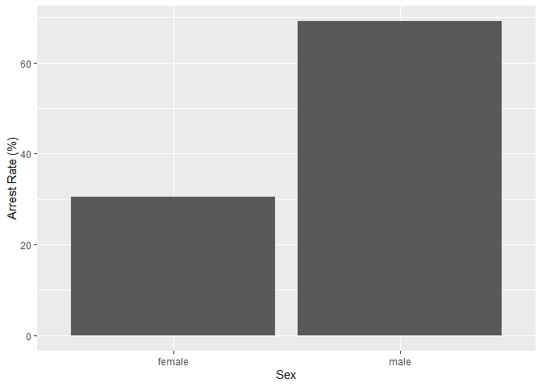
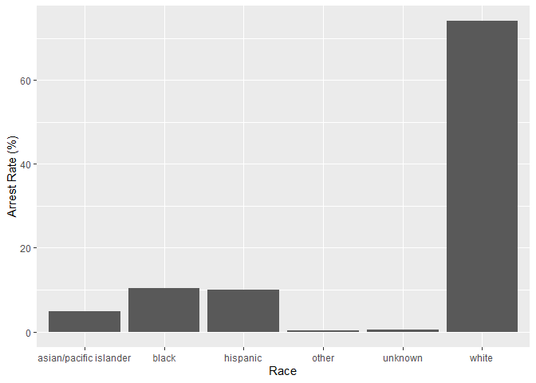
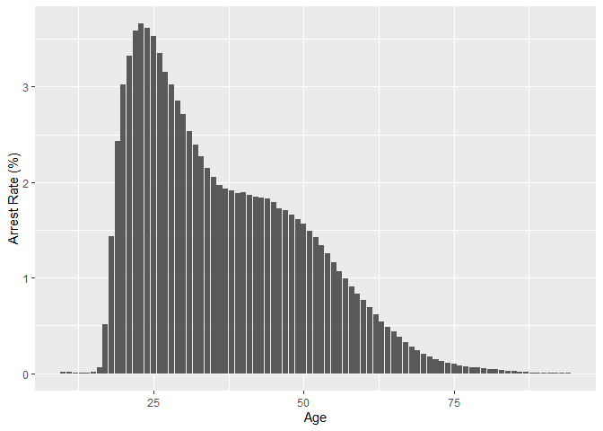

Massachusetts Highway Stops
================
Miles Mezaki
2023-05-02

- <a href="#grading-rubric" id="toc-grading-rubric">Grading Rubric</a>
  - <a href="#individual" id="toc-individual">Individual</a>
  - <a href="#due-date" id="toc-due-date">Due Date</a>
- <a href="#setup" id="toc-setup">Setup</a>
  - <a
    href="#q1-go-to-the-stanford-open-policing-project-page-and-download-the-massachusetts-state-police-records-in-rds-format-move-the-data-to-your-data-folder-and-match-the-filename-to-load-the-data"
    id="toc-q1-go-to-the-stanford-open-policing-project-page-and-download-the-massachusetts-state-police-records-in-rds-format-move-the-data-to-your-data-folder-and-match-the-filename-to-load-the-data"><strong>q1</strong>
    Go to the Stanford Open Policing Project page and download the
    Massachusetts State Police records in <code>Rds</code> format. Move the
    data to your <code>data</code> folder and match the
    <code>filename</code> to load the data.</a>
- <a href="#eda" id="toc-eda">EDA</a>
  - <a
    href="#q2-do-your-first-checks-on-the-dataset-what-are-the-basic-facts-about-this-dataset"
    id="toc-q2-do-your-first-checks-on-the-dataset-what-are-the-basic-facts-about-this-dataset"><strong>q2</strong>
    Do your “first checks” on the dataset. What are the basic facts about
    this dataset?</a>
  - <a
    href="#q3-check-the-set-of-factor-levels-for-subject_race-and-raw_race-what-do-you-note-about-overlap--difference-between-the-two-sets"
    id="toc-q3-check-the-set-of-factor-levels-for-subject_race-and-raw_race-what-do-you-note-about-overlap--difference-between-the-two-sets"><strong>q3</strong>
    Check the set of factor levels for <code>subject_race</code> and
    <code>raw_Race</code>. What do you note about overlap / difference
    between the two sets?</a>
  - <a
    href="#q4-check-whether-subject_race-and-raw_race-match-for-a-large-fraction-of-cases-which-of-the-two-hypotheses-above-is-most-likely-based-on-your-results"
    id="toc-q4-check-whether-subject_race-and-raw_race-match-for-a-large-fraction-of-cases-which-of-the-two-hypotheses-above-is-most-likely-based-on-your-results"><strong>q4</strong>
    Check whether <code>subject_race</code> and <code>raw_Race</code> match
    for a large fraction of cases. Which of the two hypotheses above is most
    likely, based on your results?</a>
  - <a href="#vis" id="toc-vis">Vis</a>
    - <a
      href="#q5-compare-the-arrest-ratethe-fraction-of-total-cases-in-which-the-subject-was-arrestedacross-different-factors-create-as-many-visuals-or-tables-as-you-need-but-make-sure-to-check-the-trends-across-all-of-the-subject-variables-answer-the-questions-under-observations-below"
      id="toc-q5-compare-the-arrest-ratethe-fraction-of-total-cases-in-which-the-subject-was-arrestedacross-different-factors-create-as-many-visuals-or-tables-as-you-need-but-make-sure-to-check-the-trends-across-all-of-the-subject-variables-answer-the-questions-under-observations-below"><strong>q5</strong>
      Compare the <em>arrest rate</em>—the fraction of total cases in which
      the subject was arrested—across different factors. Create as many
      visuals (or tables) as you need, but make sure to check the trends
      across all of the <code>subject</code> variables. Answer the questions
      under <em>observations</em> below.</a>
- <a href="#modeling" id="toc-modeling">Modeling</a>
  - <a
    href="#q6-run-the-following-code-and-interpret-the-regression-coefficients-answer-the-the-questions-under-observations-below"
    id="toc-q6-run-the-following-code-and-interpret-the-regression-coefficients-answer-the-the-questions-under-observations-below"><strong>q6</strong>
    Run the following code and interpret the regression coefficients. Answer
    the the questions under <em>observations</em> below.</a>
  - <a
    href="#q7-re-fit-the-logistic-regression-from-q6-setting-white-as-the-reference-level-for-subject_race-interpret-the-the-model-terms-and-answer-the-questions-below"
    id="toc-q7-re-fit-the-logistic-regression-from-q6-setting-white-as-the-reference-level-for-subject_race-interpret-the-the-model-terms-and-answer-the-questions-below"><strong>q7</strong>
    Re-fit the logistic regression from q6 setting <code>"white"</code> as
    the reference level for <code>subject_race</code>. Interpret the the
    model terms and answer the questions below.</a>
  - <a
    href="#q8-re-fit-the-model-using-a-factor-indicating-the-presence-of-contraband-in-the-subjects-vehicle-answer-the-questions-under-observations-below"
    id="toc-q8-re-fit-the-model-using-a-factor-indicating-the-presence-of-contraband-in-the-subjects-vehicle-answer-the-questions-under-observations-below"><strong>q8</strong>
    Re-fit the model using a factor indicating the presence of contraband in
    the subject’s vehicle. Answer the questions under <em>observations</em>
    below.</a>
  - <a
    href="#q9-go-deeper-pose-at-least-one-more-question-about-the-data-and-fit-at-least-one-more-model-in-support-of-answering-that-question"
    id="toc-q9-go-deeper-pose-at-least-one-more-question-about-the-data-and-fit-at-least-one-more-model-in-support-of-answering-that-question"><strong>q9</strong>
    Go deeper: Pose at least one more question about the data and fit at
    least one more model in support of answering that question.</a>
  - <a href="#further-reading" id="toc-further-reading">Further Reading</a>

*Purpose*: In this last challenge we’ll focus on using logistic
regression to study a large, complicated dataset. Interpreting the
results of a model can be challenging—both in terms of the statistics
and the real-world reasoning—so we’ll get some practice in this
challenge.

<!-- include-rubric -->

# Grading Rubric

<!-- -------------------------------------------------- -->

Unlike exercises, **challenges will be graded**. The following rubrics
define how you will be graded, both on an individual and team basis.

## Individual

<!-- ------------------------- -->

| Category    | Needs Improvement                                                                                                | Satisfactory                                                                                                               |
|-------------|------------------------------------------------------------------------------------------------------------------|----------------------------------------------------------------------------------------------------------------------------|
| Effort      | Some task **q**’s left unattempted                                                                               | All task **q**’s attempted                                                                                                 |
| Observed    | Did not document observations, or observations incorrect                                                         | Documented correct observations based on analysis                                                                          |
| Supported   | Some observations not clearly supported by analysis                                                              | All observations clearly supported by analysis (table, graph, etc.)                                                        |
| Assessed    | Observations include claims not supported by the data, or reflect a level of certainty not warranted by the data | Observations are appropriately qualified by the quality & relevance of the data and (in)conclusiveness of the support      |
| Specified   | Uses the phrase “more data are necessary” without clarification                                                  | Any statement that “more data are necessary” specifies which *specific* data are needed to answer what *specific* question |
| Code Styled | Violations of the [style guide](https://style.tidyverse.org/) hinder readability                                 | Code sufficiently close to the [style guide](https://style.tidyverse.org/)                                                 |

## Due Date

<!-- ------------------------- -->

All the deliverables stated in the rubrics above are due **at midnight**
before the day of the class discussion of the challenge. See the
[Syllabus](https://docs.google.com/document/d/1qeP6DUS8Djq_A0HMllMqsSqX3a9dbcx1/edit?usp=sharing&ouid=110386251748498665069&rtpof=true&sd=true)
for more information.

*Background*: We’ll study data from the [Stanford Open Policing
Project](https://openpolicing.stanford.edu/data/), specifically their
dataset on Massachusetts State Patrol police stops.

``` r
library(tidyverse)
```

    ## ── Attaching packages ─────────────────────────────────────── tidyverse 1.3.2 ──
    ## ✔ ggplot2 3.4.0     ✔ purrr   1.0.1
    ## ✔ tibble  3.1.8     ✔ dplyr   1.1.0
    ## ✔ tidyr   1.3.0     ✔ stringr 1.5.0
    ## ✔ readr   2.1.3     ✔ forcats 1.0.0
    ## ── Conflicts ────────────────────────────────────────── tidyverse_conflicts() ──
    ## ✖ dplyr::filter() masks stats::filter()
    ## ✖ dplyr::lag()    masks stats::lag()

``` r
library(broom)
library(plyr)
```

    ## Warning: package 'plyr' was built under R version 4.2.3

    ## ------------------------------------------------------------------------------
    ## You have loaded plyr after dplyr - this is likely to cause problems.
    ## If you need functions from both plyr and dplyr, please load plyr first, then dplyr:
    ## library(plyr); library(dplyr)
    ## ------------------------------------------------------------------------------
    ## 
    ## Attaching package: 'plyr'
    ## 
    ## The following objects are masked from 'package:dplyr':
    ## 
    ##     arrange, count, desc, failwith, id, mutate, rename, summarise,
    ##     summarize
    ## 
    ## The following object is masked from 'package:purrr':
    ## 
    ##     compact

# Setup

<!-- -------------------------------------------------- -->

### **q1** Go to the [Stanford Open Policing Project](https://openpolicing.stanford.edu/data/) page and download the Massachusetts State Police records in `Rds` format. Move the data to your `data` folder and match the `filename` to load the data.

*Note*: An `Rds` file is an R-specific file format. The function
`readRDS` will read these files.

``` r
## TODO: Download the data, move to your data folder, and load it
filename <- "data/yg821jf8611_ma_statewide_2020_04_01.rds"
df_data <- readRDS(filename)
```

# EDA

<!-- -------------------------------------------------- -->

### **q2** Do your “first checks” on the dataset. What are the basic facts about this dataset?

``` r
df_data %>% glimpse()
```

    ## Rows: 3,416,238
    ## Columns: 24
    ## $ raw_row_number             <chr> "1", "2", "3", "4", "5", "6", "7", "8", "9"…
    ## $ date                       <date> 2007-06-06, 2007-06-07, 2007-06-07, 2007-0…
    ## $ location                   <chr> "MIDDLEBOROUGH", "SEEKONK", "MEDFORD", "MED…
    ## $ county_name                <chr> "Plymouth County", "Bristol County", "Middl…
    ## $ subject_age                <int> 33, 36, 56, 37, 22, 34, 54, 31, 21, 56, 56,…
    ## $ subject_race               <fct> white, white, white, white, hispanic, white…
    ## $ subject_sex                <fct> male, male, female, male, female, male, mal…
    ## $ type                       <fct> vehicular, vehicular, vehicular, vehicular,…
    ## $ arrest_made                <lgl> FALSE, FALSE, FALSE, FALSE, FALSE, FALSE, F…
    ## $ citation_issued            <lgl> TRUE, FALSE, FALSE, FALSE, TRUE, TRUE, TRUE…
    ## $ warning_issued             <lgl> FALSE, TRUE, TRUE, TRUE, FALSE, FALSE, FALS…
    ## $ outcome                    <fct> citation, warning, warning, warning, citati…
    ## $ contraband_found           <lgl> NA, FALSE, NA, NA, NA, NA, NA, NA, NA, NA, …
    ## $ contraband_drugs           <lgl> NA, FALSE, NA, NA, NA, NA, NA, NA, NA, NA, …
    ## $ contraband_weapons         <lgl> NA, FALSE, NA, NA, NA, NA, NA, NA, NA, NA, …
    ## $ contraband_alcohol         <lgl> FALSE, FALSE, FALSE, FALSE, FALSE, FALSE, F…
    ## $ contraband_other           <lgl> NA, FALSE, NA, NA, NA, NA, NA, NA, NA, NA, …
    ## $ frisk_performed            <lgl> NA, FALSE, NA, NA, NA, NA, NA, NA, NA, NA, …
    ## $ search_conducted           <lgl> FALSE, TRUE, FALSE, FALSE, FALSE, FALSE, FA…
    ## $ search_basis               <fct> NA, other, NA, NA, NA, NA, NA, NA, NA, NA, …
    ## $ reason_for_stop            <chr> "Speed", NA, NA, NA, NA, "Speed", NA, NA, N…
    ## $ vehicle_type               <chr> "Passenger", "Commercial", "Passenger", "Co…
    ## $ vehicle_registration_state <fct> MA, MA, MA, MA, MA, MA, MA, MA, MA, MA, MA,…
    ## $ raw_Race                   <chr> "White", "White", "White", "White", "Hispan…

``` r
df_data %>% head()
```

    ## # A tibble: 6 × 24
    ##   raw_row_num…¹ date       locat…² count…³ subje…⁴ subje…⁵ subje…⁶ type  arres…⁷
    ##   <chr>         <date>     <chr>   <chr>     <int> <fct>   <fct>   <fct> <lgl>  
    ## 1 1             2007-06-06 MIDDLE… Plymou…      33 white   male    vehi… FALSE  
    ## 2 2             2007-06-07 SEEKONK Bristo…      36 white   male    vehi… FALSE  
    ## 3 3             2007-06-07 MEDFORD Middle…      56 white   female  vehi… FALSE  
    ## 4 4             2007-06-07 MEDFORD Middle…      37 white   male    vehi… FALSE  
    ## 5 5             2007-06-07 EVERETT Middle…      22 hispan… female  vehi… FALSE  
    ## 6 6             2007-06-07 MEDFORD Middle…      34 white   male    vehi… FALSE  
    ## # … with 15 more variables: citation_issued <lgl>, warning_issued <lgl>,
    ## #   outcome <fct>, contraband_found <lgl>, contraband_drugs <lgl>,
    ## #   contraband_weapons <lgl>, contraband_alcohol <lgl>, contraband_other <lgl>,
    ## #   frisk_performed <lgl>, search_conducted <lgl>, search_basis <fct>,
    ## #   reason_for_stop <chr>, vehicle_type <chr>,
    ## #   vehicle_registration_state <fct>, raw_Race <chr>, and abbreviated variable
    ## #   names ¹​raw_row_number, ²​location, ³​county_name, ⁴​subject_age, …

Observations:

- There are a lot of columns: raw_row_number, date, location,
  county_name, subject_age, subject_race, subject_sex, type,
  arrest_made, citation_issued, warning_issued, outcome, some contraband
  info, some search info, reason_for_stop (I presume for vehicular
  cases), vehicle_type (see previous), vehicle_registration_state (same
  as previous), and raw_race

- There are a lot of NAs. This might be because all of the cases are
  lumped together and some have contraband whereas others do not; or
  some have a search/frisk while others do not  

  Note that we have both a `subject_race` and `race_Raw` column. There
  are a few possibilities as to what `race_Raw` represents:

<!-- -->

- `race_Raw` could be the race of the police officer in the stop
- `race_Raw` could be an unprocessed version of `subject_race`

Let’s try to distinguish between these two possibilities.

### **q3** Check the set of factor levels for `subject_race` and `raw_Race`. What do you note about overlap / difference between the two sets?

``` r
## TODO: Determine the factor levels for subject_race and raw_Race
x <- levels(as.factor(df_data$subject_race))
y <- levels(as.factor(df_data$raw_Race))
x
```

    ## [1] "asian/pacific islander" "black"                  "hispanic"              
    ## [4] "white"                  "other"                  "unknown"

``` r
y
```

    ## [1] "A"                                            
    ## [2] "American Indian or Alaskan Native"            
    ## [3] "Asian or Pacific Islander"                    
    ## [4] "Black"                                        
    ## [5] "Hispanic"                                     
    ## [6] "Middle Eastern or East Indian (South Asian)"  
    ## [7] "None - for no operator present citations only"
    ## [8] "White"

**Observations**:

- What are the unique values for `subject_race`?
  - asian/pacific islander

  - black

  - white

  - hispanic

  - unknown

  - other
- What are the unique values for `raw_Race`?
  - American Indian or Alaskan Native

  - Asian or Pacific Islander

  - Black

  - Hispanic

  - Middle Eastern or East Indian (South Asian)

  - None - for no operator present citations only

  - White
- What is the overlap between the two sets?
  - asian/pacific islander

  - black

  - white

  - hispanic
- What is the difference between the two sets?
  - raw_Race contains None - for no operator present citations only and
    American Indian or Alaskan Native and Middle Eastern or East Indian
    (South Asian)

  - subject_race has “other” for classifying the previous categories

  - Based on the “None - for no operator present citations only”
    category, it seems likely that raw_Race was the race the
    officer/citation giver presumed of the vehicle operator

### **q4** Check whether `subject_race` and `raw_Race` match for a large fraction of cases. Which of the two hypotheses above is most likely, based on your results?

*Note*: Just to be clear, I’m *not* asking you to do a *statistical*
hypothesis test.

``` r
## TODO: Devise your own way to test the hypothesis posed above.
df_data_q4 <- df_data
df_data_q4$raw_Race <- mapvalues(df_data$raw_Race, from=c("American Indian or Alaskan Native", "Asian or Pacific Islander", "Black", "Hispanic", "Middle Eastern or East Indian (South Asian)", "None - for no operator present citations only", "White"), to=c("other", "asian/pacific islander", "black", "hispanic","other","unknown", "white"))
num <- nrow(df_data_q4 %>%
  filter(raw_Race == subject_race) %>%
  select(raw_Race, subject_race))
denom <- nrow(df_data)
num/denom
```

    ## [1] 0.9806173

**Observations**

Between the two hypotheses:

- `race_Raw` could be the race of the police officer in the stop
- `race_Raw` could be an unprocessed version of `subject_race`

which is most plausible, based on your results?

- race_Raw being the unprocessed subject_race seems more plausible since
  98% of the time, they are the same

## Vis

<!-- ------------------------- -->

### **q5** Compare the *arrest rate*—the fraction of total cases in which the subject was arrested—across different factors. Create as many visuals (or tables) as you need, but make sure to check the trends across all of the `subject` variables. Answer the questions under *observations* below.

(Note: Create as many chunks and visuals as you need)

``` r
total_arrests <- nrow(df_data)
sexes <- levels(df_data$subject_sex) %>% as.vector()
arrest_rate_sex <- c()
for (v in sexes) {
  t <- nrow(df_data %>%
    filter(subject_sex == v))/total_arrests
  arrest_rate_sex <- append(arrest_rate_sex, t)
}
arrest_rate_sex
```

    ## [1] 0.6914735 0.3039534

``` r
data.frame(sexes, arrest_rate_sex) %>%
ggplot(aes(x = sexes, y = arrest_rate_sex*100)) +
geom_col() +
labs(x = "Sex", y = "Arrest Rate (%)")
```

<!-- -->

``` r
races <- levels(df_data$subject_race) %>% as.vector()
arrest_rate_race <- c()
for (v in races) {
  t <- nrow(df_data %>%
    filter(subject_race == v))/total_arrests
  arrest_rate_race <- append(arrest_rate_race, t)
}
arrest_rate_race
```

    ## [1] 0.048837932 0.102923157 0.099032035 0.740516322 0.003222258 0.004981210

``` r
data.frame(races, arrest_rate_race) %>%
ggplot(aes(x = races, y = arrest_rate_race*100)) +
geom_col() +
labs(x = "Race", y = "Arrest Rate (%)")
```

<!-- -->

``` r
ages <- unique(df_data$subject_age)
arrest_rate_age <- c()
for (v in ages) {
  t <- nrow(df_data %>%
    filter(subject_age == v))/total_arrests
  arrest_rate_age <- append(arrest_rate_age, t)
}
arrest_rate_age
```

    ##  [1] 2.269748e-02 1.974131e-02 1.069100e-02 1.929901e-02 3.586313e-02
    ##  [6] 2.147713e-02 1.256763e-02 2.529625e-02 3.321636e-02 1.568041e-02
    ## [11] 4.337813e-03 8.278112e-03 2.390612e-02 1.659867e-02 2.713306e-02
    ## [16] 1.490909e-02 3.020194e-02 1.420978e-02 3.026136e-02 1.910376e-02
    ## [21] 1.115847e-03 2.855861e-02 1.342090e-02 3.354421e-02 2.781129e-03
    ## [26] 1.431663e-02 3.615556e-02 2.057819e-02 6.131306e-03 2.431476e-02
    ## [31] 3.155225e-02 0.000000e+00 1.722187e-02 1.840885e-02 1.899107e-02
    ## [36] 5.775359e-04 3.528384e-02 3.659493e-02 1.160487e-02 1.704185e-02
    ## [41] 1.830025e-02 1.865122e-02 4.868221e-03 9.076944e-03 1.475307e-03
    ## [46] 1.793698e-02 1.848261e-02 7.646715e-03 1.608026e-02 9.888070e-03
    ## [51] 6.937456e-03 1.595322e-04 1.886168e-02 2.354344e-03 4.911836e-04
    ## [56] 5.126399e-03 3.206451e-03 1.746951e-03 9.563151e-04 5.437853e-03
    ## [61] 6.030025e-05 2.050501e-03 6.249565e-04 7.446788e-04 4.212236e-04
    ## [66] 3.786621e-03 8.418617e-04 3.802428e-04 2.037329e-04 1.253426e-03
    ## [71] 3.091120e-04 5.997826e-04 8.957221e-05 2.485190e-04 1.387491e-04
    ## [76] 1.162097e-04 7.669255e-05 1.165024e-04 1.287966e-04 8.283966e-05
    ## [81] 5.122594e-05 3.658996e-05 1.844134e-05 1.317238e-05 4.976234e-06
    ## [86] 1.463598e-06

``` r
data.frame(ages, arrest_rate_age) %>%
ggplot(aes(x = ages, y = arrest_rate_age * 100)) +
geom_col() +
labs(x = "Age", y = "Arrest Rate (%)")
```

    ## Warning: Removed 1 rows containing missing values (`position_stack()`).

<!-- -->

**Observations**:

- How does `arrest_rate` tend to vary with `subject_age`?
  - As age increases beyond the mid 20’s, seemingly fewer
    arrests/citations occur.
  - Each age is collectively responsible for less than 5% of the total
    citations/arrests.
- How does `arrest_rate` tend to vary with `subject_sex`?
  - Men were arrested more than women were
  - There is evidently not data on other genders
  - The arrest rate for men is over double that of women
- How does `arrest_rate` tend to vary with `subject_race`?
  - The vast majority \~74% of arrests/citations are made out to white
    subject_race members.
  - Roughly 10% of arrests are distributed to hispanic and black race
    groups as well, each

# Modeling

<!-- -------------------------------------------------- -->

We’re going to use a model to study the relationship between `subject`
factors and arrest rate, but first we need to understand a bit more
about *dummy variables*

### **q6** Run the following code and interpret the regression coefficients. Answer the the questions under *observations* below.

``` r
## NOTE: No need to edit; inspect the estimated model terms.
fit_q6 <-
  glm(
    formula = arrest_made ~ subject_age + subject_race + subject_sex,
    data = df_data %>%
      filter(
        !is.na(arrest_made),
        subject_race %in% c("white", "black", "hispanic")
      ),
    family = "binomial"
  )

fit_q6 %>% tidy()
```

    ## # A tibble: 5 × 5
    ##   term                 estimate std.error statistic   p.value
    ##   <chr>                   <dbl>     <dbl>     <dbl>     <dbl>
    ## 1 (Intercept)           -2.67    0.0132      -202.  0        
    ## 2 subject_age           -0.0142  0.000280     -50.5 0        
    ## 3 subject_racehispanic   0.513   0.0119        43.3 0        
    ## 4 subject_racewhite     -0.380   0.0103       -37.0 3.12e-299
    ## 5 subject_sexfemale     -0.755   0.00910      -83.0 0

``` r
fit_q6$coefficients
```

    ##          (Intercept)          subject_age subject_racehispanic 
    ##          -2.66963979          -0.01416458           0.51291815 
    ##    subject_racewhite    subject_sexfemale 
    ##          -0.37972888          -0.75500367

**Observations**:

- Which `subject_race` levels are included in fitting the model?
  - White, hispanic, and black, though only white and hispanic have
    coefficients
- Which `subject_race` levels have terms in the model?
  - Only white and hispanic

You should find that each factor in the model has a level *missing* in
its set of terms. This is because R represents factors against a
*reference level*: The model treats one factor level as “default”, and
each factor model term represents a change from that “default” behavior.
For instance, the model above treats `subject_sex==male` as the
reference level, so the `subject_sexfemale` term represents the *change
in probability* of arrest due to a person being female (rather than
male).

The this reference level approach to coding factors is necessary for
[technical
reasons](https://www.andrew.cmu.edu/user/achoulde/94842/lectures/lecture10/lecture10-94842.html#why-is-one-of-the-levels-missing-in-the-regression),
but it complicates interpreting the model results. For instance; if we
want to compare two levels, neither of which are the reference level, we
have to consider the difference in their model coefficients. But if we
want to compare all levels against one “baseline” level, then we can
relevel the data to facilitate this comparison.

By default `glm` uses the first factor level present as the reference
level. Therefore we can use
`mutate(factor = fct_relevel(factor, "desired_level"))` to set our
`"desired_level"` as the reference factor.

### **q7** Re-fit the logistic regression from q6 setting `"white"` as the reference level for `subject_race`. Interpret the the model terms and answer the questions below.

``` r
## TODO: Re-fit the logistic regression, but set "white" as the reference
## level for subject_race
fit_q7 <-
  glm(
    formula = arrest_made ~ subject_age + subject_race %>% fct_relevel("white") + subject_sex,
    data = df_data %>%
      filter(
        !is.na(arrest_made)
      ) ,
    family = "binomial"
  )

fit_q7 %>% tidy()
```

    ## # A tibble: 8 × 5
    ##   term                                        estim…¹ std.e…² statis…³   p.value
    ##   <chr>                                         <dbl>   <dbl>    <dbl>     <dbl>
    ## 1 "(Intercept)"                               -3.04   1.08e-2 -282.    0        
    ## 2 "subject_age"                               -0.0144 2.77e-4  -52.0   0        
    ## 3 "subject_race %>% fct_relevel(\"white\")as… -0.389  2.00e-2  -19.4   7.72e- 84
    ## 4 "subject_race %>% fct_relevel(\"white\")bl…  0.379  1.03e-2   36.9   7.64e-299
    ## 5 "subject_race %>% fct_relevel(\"white\")hi…  0.892  8.59e-3  104.    0        
    ## 6 "subject_race %>% fct_relevel(\"white\")ot… -0.0246 6.83e-2   -0.360 7.18e-  1
    ## 7 "subject_race %>% fct_relevel(\"white\")un… -1.94   3.15e-1   -6.15  7.82e- 10
    ## 8 "subject_sexfemale"                         -0.751  8.96e-3  -83.8   0        
    ## # … with abbreviated variable names ¹​estimate, ²​std.error, ³​statistic

``` r
#logit2prob <- function(logit){
#  odds <- exp(logit)
#  prob <- odds / (1 + odds)
#  return(prob)
#}
#probs <- logit2prob(coef(fit_q7)) %>% tidy()
#probs
```

**Observations**:

- Which `subject_race` level has the highest probability of being
  arrested, according to this model? Which has the lowest probability?
  - Hispanic has the highest probability of being arrested according to
    the model
  - Unknown has the lowest
- What could explain this difference in probabilities of arrest across
  race? List **multiple** possibilities.
  - It could be that there are more hispanic people than black,
    asian/pacific islander, other, etc.
  - It could be that since arrests are made by humans, there is
    intrinsic bias to the data
- Look at the sent of variables in the dataset; do any of the columns
  relate to a potential explanation you listed?
  - It seems like most other races do not get arrested as much as white
    and hispanic populations in the sample do.

One way we can explain differential arrest rates is to include some
measure indicating the presence of an arrestable offense. We’ll do this
in a particular way in the next task.

### **q8** Re-fit the model using a factor indicating the presence of contraband in the subject’s vehicle. Answer the questions under *observations* below.

``` r
## TODO: Repeat the modeling above, but control for whether contraband was found
## during the police stop
fit_q8 <-
  glm(
    formula = arrest_made ~ subject_age + subject_race %>% fct_relevel("white") + subject_sex + contraband_found,
    data = df_data %>%
      filter(
        !is.na(arrest_made)
      ) ,
    family = "binomial"
  )

fit_q8 %>% tidy()
```

    ## # A tibble: 9 × 5
    ##   term                                        estimate std.e…¹ stati…²   p.value
    ##   <chr>                                          <dbl>   <dbl>   <dbl>     <dbl>
    ## 1 "(Intercept)"                                -1.70   3.34e-2 -50.8   0        
    ## 2 "subject_age"                                 0.0219 8.51e-4  25.7   2.71e-145
    ## 3 "subject_race %>% fct_relevel(\"white\")as…  -0.0386 5.85e-2  -0.660 5.09e-  1
    ## 4 "subject_race %>% fct_relevel(\"white\")bl…  -0.0525 2.69e-2  -1.95  5.12e-  2
    ## 5 "subject_race %>% fct_relevel(\"white\")hi…   0.218  2.37e-2   9.22  2.88e- 20
    ## 6 "subject_race %>% fct_relevel(\"white\")ot…  -0.291  1.47e-1  -1.98  4.77e-  2
    ## 7 "subject_race %>% fct_relevel(\"white\")un… -10.8    4.90e+1  -0.221 8.25e-  1
    ## 8 "subject_sexfemale"                          -0.311  2.54e-2 -12.3   1.25e- 34
    ## 9 "contraband_foundTRUE"                        0.603  1.89e-2  31.9   1.76e-223
    ## # … with abbreviated variable names ¹​std.error, ²​statistic

**Observations**:

- How does controlling for found contraband affect the `subject_race`
  terms in the model?
  - It somewhat normalizes the arrest rate
- What does the *finding of contraband* tell us about the stop? What
  does it *not* tell us about the stop?
  - If contraband is found, this probably means that a subject’s race
    will not matter to an arrest
  - If contraband is not found, we don’t know how much an arrest made
    depends on race
  - We also do not know why the stop occurs if contraband is not found;
    if it is found, it tells us that there may have been reasonable
    suspicion of contraband in the first place. But we don’t *know* why
    the vehicle was stopped just because contraband is found.

### **q9** Go deeper: Pose at least one more question about the data and fit at least one more model in support of answering that question.

Does being outside Suffolk county influence probability of minority
arrest (relative to including Suffolk county)?

``` r
fit_q9 <-
  glm(
    formula = arrest_made ~ subject_age + subject_race %>% fct_relevel("white") + subject_sex,
    data = df_data %>%
      filter(
        !is.na(arrest_made),
        !(county_name %in% c("Suffolk County"))
      ) ,
    family = "binomial"
  )

fit_q9 %>% tidy()
```

    ## # A tibble: 8 × 5
    ##   term                                         estim…¹ std.e…² statis…³  p.value
    ##   <chr>                                          <dbl>   <dbl>    <dbl>    <dbl>
    ## 1 "(Intercept)"                                -3.08   1.14e-2 -271.    0       
    ## 2 "subject_age"                                -0.0121 2.91e-4  -41.6   0       
    ## 3 "subject_race %>% fct_relevel(\"white\")asi… -0.336  2.22e-2  -15.1   1.10e-51
    ## 4 "subject_race %>% fct_relevel(\"white\")bla…  0.434  1.12e-2   38.6   0       
    ## 5 "subject_race %>% fct_relevel(\"white\")his…  0.912  9.17e-3   99.5   0       
    ## 6 "subject_race %>% fct_relevel(\"white\")oth… -0.0275 7.36e-2   -0.373 7.09e- 1
    ## 7 "subject_race %>% fct_relevel(\"white\")unk… -1.73   3.16e-1   -5.47  4.53e- 8
    ## 8 "subject_sexfemale"                          -0.760  9.48e-3  -80.3   0       
    ## # … with abbreviated variable names ¹​estimate, ²​std.error, ³​statistic

**Observations**:

- The likelihood of arrest as someone Hispanic is even higher, but being
  black is lower.
- This is interesting because in 2020
  - black population in Suffolk County was
    [172,540](https://www.google.com/search?q=massachusetts+black+population+in+suffolk+county&sxsrf=APwXEdcVK90iiUoZ3azwRqpHrw5tjgO2dw%3A1683168995271&ei=4x5TZNaUEMus5NoP2-qYmAM&ved=0ahUKEwiWkr2Q1dr-AhVLFlkFHVs1BjMQ4dUDCBA&uact=5&oq=massachusetts+black+population+in+suffolk+county&gs_lcp=Cgxnd3Mtd2l6LXNlcnAQAzIFCAAQogQyBQgAEKIEMgUIABCiBDIFCAAQogQ6CggAEEcQ1gQQsANKBAhBGABQjidYkC1g7jNoBHAAeACAAVWIAZ0BkgEBMpgBAKABAcgBCMABAQ&sclient=gws-wiz-serp)

  - the population in MA was
    [513,369](https://www.google.com/search?q=massachusetts+black+population+&sxsrf=APwXEdd3XycbfNv0E3ZRd7YsgvAYvpNWHQ%3A1683169038310&ei=Dh9TZPa7Euah5NoPht-NiAQ&ved=0ahUKEwj2-v-k1dr-AhXmEFkFHYZvA0EQ4dUDCBA&uact=5&oq=massachusetts+black+population+&gs_lcp=Cgxnd3Mtd2l6LXNlcnAQAzIECCMQJzIFCAAQgAQyBggAEBYQHjIGCAAQFhAeMgYIABAWEB4yBggAEBYQHjIGCAAQFhAeMgYIABAWEB4yBggAEBYQHjIICAAQigUQhgM6CggAEEcQ1gQQsANKBAhBGABQswdY6Alg0g1oAXAAeACAAViIAfMBkgEBM5gBAKABAcgBCMABAQ&sclient=gws-wiz-serp)

    - 33.6% of the MA black population resides in Suffolk County

  - Hispanic population in Suffolk County was
    [183,798](https://www.google.com/search?q=massachusetts+hispanic+population+suffolk+county&sxsrf=APwXEdeAJMn4f5vs-rdfmj7dHNjAftsLuQ%3A1683169221967&ei=xR9TZNrEOvWq5NoPrKKE0Ag&ved=0ahUKEwiau8n81dr-AhV1FVkFHSwRAYoQ4dUDCBA&uact=5&oq=massachusetts+hispanic+population+suffolk+county&gs_lcp=Cgxnd3Mtd2l6LXNlcnAQAzIFCCEQoAEyBQghEKABMgUIIRCgATIFCCEQqwI6CggAEEcQ1gQQsAM6BQgAEIAEOgYIABAWEB46CAgAEIoFEIYDOggIIRAWEB4QHUoECEEYAFC4BliSH2DvH2gCcAF4AIABcogBiwqSAQQxMS4zmAEAoAEByAEIwAEB&sclient=gws-wiz-serp)

  - the population in MA was
    [828,140](https://www.google.com/search?q=massachusetts+hispanic+population&sxsrf=APwXEddQwP-U7CopYFwcXVIAea2YWW3bgw%3A1683169172609&ei=lB9TZLLRJOWg5NoPnrWi2AM&ved=0ahUKEwiy64Tl1dr-AhVlEFkFHZ6aCDsQ4dUDCBA&uact=5&oq=massachusetts+hispanic+population&gs_lcp=Cgxnd3Mtd2l6LXNlcnAQAzIFCAAQgAQyBAgAEB4yBggAEAgQHjIICAAQigUQhgMyCAgAEIoFEIYDMggIABCKBRCGAzIICAAQigUQhgM6BwgjELADECc6CggAEEcQ1gQQsAM6CggAEIoFELADEEM6EAgAEIAEELEDEIMBEEYQ-wE6BwgAEIoFEEM6CggAEIAEEBQQhwI6BggAEAcQHjoICAAQCBAHEB46CAgAEAgQHhANOgcIABANEIAESgQIQRgAUMoXWO8iYMUkaARwAXgAgAFdiAHIBZIBAjEwmAEAoAEByAEKwAEB&sclient=gws-wiz-serp)

    - 22.2% of the MA Hispanic population resides in Suffolk County

  - As such, it may be because ethnically Hispanic people are less
    concentrated in Suffolk County that the arrest rate is higher

## Further Reading

<!-- -------------------------------------------------- -->

- Stanford Open Policing Project
  [findings](https://openpolicing.stanford.edu/findings/).
